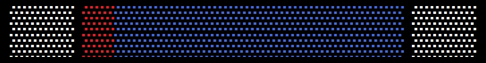
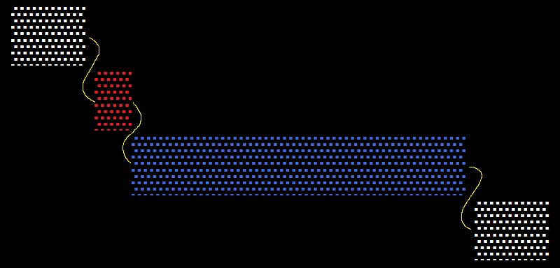
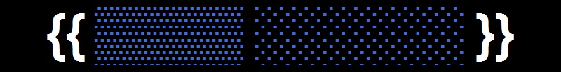
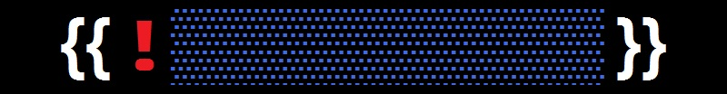
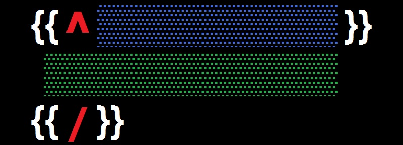
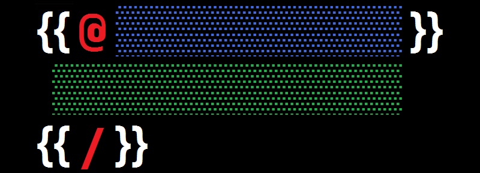
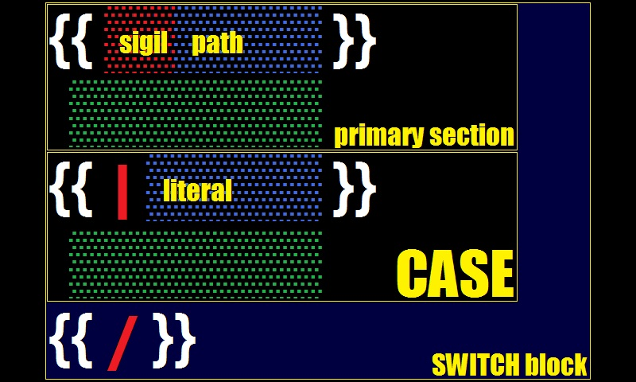
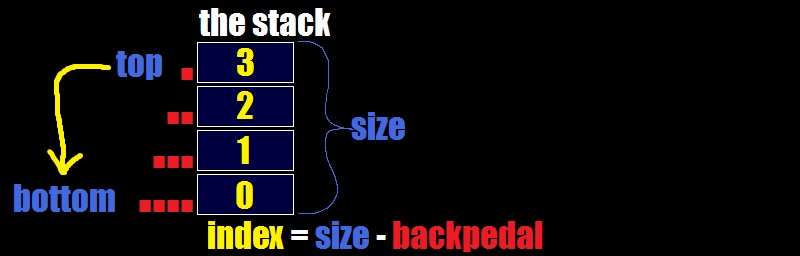

# mustache
[](#about)
## about<!-- {{{ -->
`sm-mustache` aka `SM\Mustache` is
a ***template processor***<sup>[◥][m-engine]</sup>
implementation of ***mustache templates***<sup>[◥][template]</sup>
written in ***PHP***<sup>[◥](https://www.php.net/)</sup>
and compatible with
***mustache specification***<sup>[◥](https://github.com/mustache/spec)</sup>
in its reasonable parts.
the main chapters of this document are
[syntax definitions](#syntax)
and [usage instructions](#usage).

<details><summary>what is templating language?</summary>

> A templating language is a specific syntax or markup that allows for the creation of templates. It provides ways to define placeholders, variables, conditions, loops, and other elements that can be used to generate dynamic content.
> 
> On the other hand, a template processor is a software or tool that takes a template written in a templating language and applies it to specific data to generate an output. It interprets the template using the defined syntax rules and processes the data accordingly. The template processor replaces the placeholders with actual values and executes any logic defined in the template. It can also handle other operations like rendering the template into a final output format, such as HTML, JSON, or plain text.
> 
> In summary, a templating language is the language in which templates are written, while a template processor is the software or tool that interprets and processes those templates to generate the desired output. The templating language provides the rules and structure, while the template processor executes those rules to generate the final result.
</details>
<details><summary>are template processors relevant these days?</summary>

> Yes, template processors are still relevant these days. Template processors are tools or software libraries that allow you to generate dynamic content by combining static text templates with placeholder variables and logic. They are commonly used in web development, email generation, document generation, and other applications where dynamic content creation is required.
> 
> Template processors provide a convenient way to separate the design and presentation of content from the logic or data that drives it, making it easier to manage and maintain. They often support various template languages that offer syntax for conditionals, loops, and other control structures. This allows developers to dynamically generate content based on specific conditions or iterate over data collections.
> 
> Many popular programming frameworks and content management systems also incorporate template processors as a core feature. For example, Django uses its own template engine, and PHP has popular template processors like Smarty and Twig.
> 
> Overall, template processors continue to be relevant because they simplify dynamic content generation, improve code readability and maintainability, and streamline web development and other related tasks.
</details>

### history<!--{{{-->
<details><summary>2008/04 CTemplate </summary>

> Welcome to the C++ CTemplate system!  (This project was originally called Google Templates, due to its origin as the template system used for Google search result pages, but now has a more general name matching its community-owned nature.
> 
> **Motivation**
> 
> A template system can be used to separate output formatting specifications, which govern the appearance and location of output text and data elements, from the executable logic which prepares the data and makes decisions about what appears in the output.
> 
> Template systems lie along a continuum of power versus separation. "Powerful" constructs like variable assignment or conditional statements make it easy to modify the look of an application within the template system exclusively, without having to modify any of the underlying "application logic".  They do so, however, at the cost of separation, turning the templates themselves into part of the application logic.
> 
> This template system leans strongly towards preserving the separation of logic and presentation.  It is intentionally constrained in the features it supports and, as a result, applications tend to require quite a bit of code to instantiate a template.  This may not be to everybody's tastes.  However, while this design limits the power of the template ***language***, it does not limit the power or flexibility of the template ***system***.  This system supports arbitrarily complex text formatting.  Many Google applications, including the "main" Google web search, use this system for formatting output.
> 
> Finally, this system is designed with an eye towards efficiency. Template instantiation is very quick, with an eye towards minimizing both memory use and memory fragmentation.

- https://github.com/OlafvdSpek/ctemplate
</details>
<details><summary>2008/04 Erlang Template Engine (Prototype)</summary>

> Some may argue, that it is pointless to write one's own template engine. But what if there's no suitable one? Common template engines are too heavy, provide enormous functionality, most of which is unnecessary rubbish, if you use templates right. What do I mean by right use of templates? To answer this question, I would like you to answer another one: what templates are intended for? Templates are intended for representation, hence must not include any logic. Logic is for developers, templates are for designers. Only template engines following this concept but still fully-functional I'm aware of are PHPLib's Template and Google CTemplate. Update: Plus Template::Simple for Perl.
> 
> Several years ago I wrote a template engine in Perl, which used PHPLib syntax, but had object-oriented approach for templates, so that every template or block inside a template was an object. If I get round to that, I'll clean up the code and post it in this blog later, and perhaps switch to Google CTemplate syntax, which I discovered recently.
> 
> If we deal with an object-oriented language, the natural way of representing a template is wrapping it into an object, using object's properties for template's variables and regarding nested templates as nested objects.
> 
> Erlang is a functional programming language. What is the natural way to express anything in a functional programming language? Right, wrap it into a function! In this article I present my experiment of creating a template engine using functional paradigm.
> 
> My Erlang template engine uses Google CTemplate syntax. Template variables are expressed through function arguments, and nested templates are expressed through descent calls to other functions.
</details>
<details><summary>2009/09 mustache.rb</summary>

> Inspired by ctemplate and et, Mustache is a framework-agnostic way to render logic-free views.
> 
> As ctemplates says, "It emphasizes separating logic from presentation: it is impossible to embed application logic in this template language."
> 
> For a list of implementations (other than Ruby) and tips, see http://mustache.github.io/.
> 
> **Overview**
> 
> Think of Mustache as a replacement for your views. Instead of views consisting of ERB or HAML with random helpers and arbitrary logic, your views are broken into two parts: a Ruby class and an HTML template.
> 
> We call the Ruby class the "view" and the HTML template the "template."
> 
> All your logic, decisions, and code is contained in your view. All your markup is contained in your template. The template does nothing but reference methods in your view.
> 
> This strict separation makes it easier to write clean templates, easier to test your views, and more fun to work on your app's front end.
> 
> **Why?**
> 
> I like writing Ruby. I like writing HTML. I like writing JavaScript.
> 
> I don't like writing ERB, Haml, Liquid, Django Templates, putting Ruby in my HTML, or putting JavaScript in my HTML.

- https://github.com/mustache/mustache
- https://youtu.be/CxT-IVdhIRU
</details>
<details><summary>2009/10 mustache.js</summary>

> mustache.js is a zero-dependency implementation of the mustache template system in JavaScript.
> 
> Mustache is a logic-less template syntax. It can be used for HTML, config files, source code - anything. It works by expanding tags in a template using values provided in a hash or object.
> 
> We call it "logic-less" because there are no if statements, else clauses, or for loops. Instead there are only tags. Some tags are replaced with a value, some nothing, and others a series of values.
> 
> **The Parable of Mustache.js**
> 
> In October 2009 Defunkt released mustache.rb. It looked useful to me at the time, but I needed it in JavaScript. The code was just under 200 lines and simple enough that I thought I could port it over on a lazy Sunday, or Saturday, I forget.
> 
> So I did, and to this day, I believe my biggest contribution to mustache.js was not all the fancy stuff that happened since, but the initial transliteration of Ruby to JavaScript. Yes, transliteration, Ruby and JavaScript are close enough that I did a more or less line by line port of the original code. I can’t claim I did any programming myself there.
> 
> If you look at the early versions of both projects, they look remarkably similar
> 
> mustache.rb was a huge hit in Ruby land right away and soon after I did my port a number of very smart people came around and rewrote the existing RegEx based “parser” (eugh) into a proper parser and compiler combination to make sure all proper computer science theory is applied and things run most efficient.
> 
> I looked back at the code then and couldn’t find my way around, things were split over dozens of files and I am sure it all made sense to a very organised brain, but I couldn’t even begin to start to understand what the whole thing did. And I remember distinctly that I was happy that I found mustache.rb in the before state so that I had a chance to port it. I would never have begun to try if I had found the “more optimal” solution.
> 
> The realisation there though made me also a bit sad. I am all for doing the right thing and executing things faster and everything, but it bugged me that the clarity of the code was all gone now.
> 
> Then other smart people came and wanted to do the same for mustache.js and I was hesitant. But instead of trying to argue with clarity, because fuck that if we can make it 10x faster, my argument was that these parsers & compilers are way too long for a JavaScript implementation that was targeted at the browser. My tagline was “by the time your compiler is finally done downloading, my RegEx parser has already produced a result”. It was of course a bit of a cop-out, but I got quite far with it.
> 
> Until Nate showed up and wrote a parser/compiler in ~350 lines of code (that was roughly the acceptable limit for me then) and I finally lost that argument too. But it took a while until mustache.js finally got its well needed superpowers, with huge help from Michael.
> 
> Meanwhile, I met Yehuda Katz at a conference and someone introduced me as “Jan, he does CouchDB and mustache.js” and Yehuda just said “Oh boy, I’m going to upset you soon.” and then avoided me for the rest of the conference (or it was just coincidence, I don’t know :). A week later he released handlebars.js, a mustache.js-inspired templating engine with some extra features that were really useful. But it wasn’t according to spec, just close enough, that a lot of people started using it. I thought “good for them”, but I secretly (or not so secretly) wanted to steal the best ideas and get people to use mustache.js instead. That didn’t really go anywhere because people stopped working on the spec in a sensible manner and we couldn’t agree on more features. And eventually, I spent more time with CouchDB again.
> 
> In the meantime many more mustache implementations in other languages appeared and one implicit design goal between was it to allow sharing of templates between them and produce compatible output. There is even a spec.
> 
> Around the same time Twitter started using mustache.js in the frontend and it was a great honour. But they too preferred a proper parser/compiler implementation so @fat & team went ahead and wrote Hogan, a mustache.js-compatible implementation with a faster load and runtime. @fat talked about this at his 2012 JSConf US talk, he got asked why he didn’t submit a pull request to mustache.js instead of making a new project. He said that a Pull Request that consists of “Hey, I threw away all your code and replaced it with mine” isn’t such a good idea. I agree, it wouldn’t have left the best impression.
> 
> He praised though, that they were able to build a compatible implementation that could compete on its own merits while still being compatible with a spec and he said that all library development should be done that way. Too often we conflate a great idea with its implementation and we would be better of allowing different ones and let users pick and choose their poison.
> 
> While watching @fat speak, it dawned on me that if I look at things this way, then the RegEx implementation of mustache.js is just another implementation of the same spec and its merits are tight and accessible code. And I could have hugged him for it. In fact I ran up on stage during the talk and nearly ran him over (22m:15s). My beloved implementation still had a reason to exist and that made me very happy. Until today, the 0.4 branch of mustache.js is still around.
> 
> **Lessons Learned:**
> 
> Accessible code has merit over optimised code, even if the optimised code should be used most of the time.
> 
> Build libraries with a spec, encourage competing implementations. (We plan to do this for Hoodie)
> 
> Hugs win.
> 
> The state of mustache today is alright, the implementations are all reasonably mature projects and people just use them. But there are a few that want to move it forward but are hindered by the complacency of the early adopters who have moved on to other things (including me). I hope we can get that resolved eventually.
> 
> On that note, mustache.js has a number of interesting Pull Requests and issues open and if anyone is interested in taking over maintainership, please make yourself heard in on the GitHub project.

- https://writing.jan.io/2013/11/01/the-parable-of-mustache-js.html
- https://writing.jan.io/mustache-2.0.html
</details>
<details><summary>2010/03 mustache.php</summary>

> A Mustache implementation in PHP.

- https://github.com/bobthecow/mustache.php
</details>
<details><summary>2010/07 handlebars.js</summary>

> Handlebars provides the power necessary to let you build semantic templates effectively with no frustration. Handlebars is largely compatible with Mustache templates. In most cases it is possible to swap out Mustache with Handlebars and continue using your current templates.
> 
> Checkout the official Handlebars docs site at handlebarsjs.com and try our live demo.
> 
> **Precompiling Templates**
> 
> Handlebars allows templates to be precompiled and included as javascript code rather than the handlebars template allowing for faster startup time. Full details are located here.
> 
> **Differences Between Handlebars.js and Mustache**
> 
> Handlebars.js adds a couple of additional features to make writing templates easier and also changes a tiny detail of how partials work.
> 
> - Nested Paths
> - Helpers
> - Block Expressions
> - Literal Values
> - Delimited Comments
> 
> Block expressions have the same syntax as mustache sections but should not be confused with one another. Sections are akin to an implicit each or with statement depending on the input data and helpers are explicit pieces of code that are free to implement whatever behavior they like. The mustache spec defines the exact behavior of sections. In the case of name conflicts, helpers are given priority.
> 
> **Compatibility**
> 
> There are a few Mustache behaviors that Handlebars does not implement.
> 
> - Handlebars deviates from Mustache slightly in that it does not perform recursive lookup by default. The compile time compat flag must be set to enable this functionality. Users should note that there is a performance cost for enabling this flag. The exact cost varies by template, but it's recommended that performance sensitive operations should avoid this mode and instead opt for explicit path references.
> - The optional Mustache-style lambdas are not supported. Instead Handlebars provides its own lambda resolution that follows the behaviors of helpers.
> - Handlebars does not allow space between the opening {{ and a command character such as #, / or >. The command character must immediately follow the braces, so for example {{> partial }} is allowed but {{ > partial }} is not.
> - Alternative delimiters are not supported.
> 

- https://github.com/handlebars-lang/handlebars.js
</details>
<details><summary>2011/12 hogan.js</summary>

> **Features**
> 
> Hogan is fast--try it on your workload.
> 
> Hogan has separate scanning, parsing and code generation phases. This way it's possible to add new features without touching the scanner at all, and many different code generation techniques can be tried without changing the parser.
> 
> Hogan exposes scan and parse methods. These can be useful for pre-processing templates on the server.
> 
> It's also possible to use HoganTemplate objects without the Hogan compiler present. That means you can pre-compile your templates on the server, and avoid shipping the compiler. However, the optional lambda features from the Mustache spec require the compiler and the original template source to be present.
> 
> Hogan also supports template inheritance, and maintains compatibility with other implementations like mustache.java, mustache.php, and GRMustache
> 
> **Why Hogan.js?**
> 
> Why another templating library?
> 
> Hogan.js was written to meet three templating library requirements: good performance, standalone template objects, and a parser API.

- https://github.com/twitter/hogan.js
- https://youtu.be/zwoiwoVNaCQ
</details>
<!--}}}-->

### principles
- `logic-less` - in comparison with other template processors, where data is sliced and diced inside the template, this implementation strives to control ***the data flow*** through the template. in practice, it looks like ***more concise syntax*** with selections instead of cryptic expressions. thus, ***less mental load*** - more templating.
- `data for template` - template is more important than data, a variety sets of data may fit into a single template. paths used in the ***template should look nice***, readable and explanatory. the question of escaping sigils to accommodate data should never arise - avoid `template for data` at all costs, do a preliminary ***data massaging*** when necessary.
- `null-free` - a **null**<sup>[◥][php-null]</sup> is the absence of data. the absence of data leads to the search for imperative solution in the template, which contradicts the `logic-less` principle. thus, to fill the gaps, the [use of helpers](#preparation) is recommended - replace nulls with special case values.

### performance
running in ***the JIT mode***<sup>[◥](https://php.watch/versions/8.0/JIT)</sup>,
this implementation is comparable to various JS implementations:
[](#performance)

<!-- }}} -->
## syntax<!-- {{{ -->
### clauses
[](#clauses)
> *The army consists of the first infantry division and eight million replacements.*
> 
> **Sebastian Junger**

the smallest unit of
***mustache language***<sup>[◥][m-lang]</sup>
is the ***clause***<sup>[◥][m-clause]</sup>
which is ***removed or replaced***<sup>[◥][substitution]</sup>
in the [resulting output](#examples).

a clause consists of:
- [delimiters](#delimiters)
- [sigil](#sigils) (optional)
- [path](#paths) or ***literal***<sup>[◥][literal]</sup> or ***annotation***<sup>[◥][annotation]</sup> (optional)

there are two kinds of clauses:
- ***independent***<sup>[◥][m-clause-ind]</sup> are [variables](#variables) and [comments](#comments).
- ***dependent***<sup>[◥][m-clause-dep]</sup> are composed in [blocks](#blocks).

### indentation
[](#indentation)

***for better appearance***<sup>[◥][readability]</sup>,
all [clause](#clauses) components -
[delimiters](#delimiters), [sigil](#sigils) and [path](#paths)
***can align with each other***<sup>[◥][free-form]</sup>
using ***whitespace***<sup>[◥][whitespace]</sup>.


### delimiters
[](#delimiters)

***delimiters***<sup>[◥][m-delims]</sup> are
a ***pair of markers***
that ***frame the stem***<sup>[◥][circumfix]</sup>
of a [clause](#clauses) in the template.
the default are **`{{`** and **`}}`**
which look like a ***moustache***<sup>[◥][moustache]</sup>.

the first delimiter is called ***opening***,
the second - ***closing***.
<details><summary>what balanced delimiters are?</summary>

> Balanced delimiters refer to a pair of opening and closing symbols, such as parentheses "()," brackets "[]," or curly braces "{}," used in programming languages and mathematical expressions to group and organize elements. They are called balanced because they ensure that the order and nesting of the delimiters are proper and consistent.
> 
> The term "balanced" implies that for a set of delimiters to be considered balanced, every opening symbol must have a corresponding closing symbol, and they must match in terms of type (e.g., an opening parenthesis matches with a closing parenthesis). Moreover, the order in which the delimiters appear must follow a hierarchical structure, meaning that each opening delimiter must be closed before a higher-level delimiter can be closed.
> 
> For example, the expression "(2 + 3) * [4 / {5 - 1}]" contains balanced delimiters because each opening symbol has a corresponding closing symbol, and the nested order of the delimiters is correct. If any opening or closing symbol is missing, or if the order of the delimiters is incorrect, the expression would be considered unbalanced.
</details>

***custom delimiters*** can be
[set once during instantiation](#custom-delimiters).
some examples: `{: :}`, `/* */`, `<{ }>`, `<[ ]>`,
`<% %>`, `[% %]`, ``, `(( ))`, `[[ ]]`,
`<!--{ }-->`, `{{{ }}}`.

such balanced delimiters do not have to mirror each other or
be of equal length, but they ***must differ***
to avoid ***delimiter collision***.
a single character may also be used as a delimiter, but:
> *There is no such thing as accident; It is fate misnamed.*
> 
> **Napoleon Bonaparte**

<details><summary>what is delimiter collision?</summary>

> Delimiter collision refers to a situation where the chosen delimiter used to separate data fields within a dataset appears within the actual data itself, leading to ambiguity and confusion.
> 
> This problem often arises in data processing, particularly when dealing with structured data formats such as CSV (comma-separated values) files or plain text documents with delimiters. These delimiters are crucial for software to correctly identify and separate the individual data fields.
> 
> When the chosen delimiter is mistakenly present within the data, it can cause issues during parsing or processing the data. For example, if a comma is chosen as the delimiter and a data field contains a comma as part of its value, the software may incorrectly interpret the comma within the field as a delimiter, resulting in the data being split into undesired parts.
> 
> Similarly, if a delimiter collision occurs in a plain text document, it may cause problems when extracting or analyzing the data using text mining or natural language processing techniques. This can lead to errors, loss of data integrity, and inaccurate analysis or insights.
> 
> To address delimiter collision, various strategies can be employed. One approach is to use a different delimiter or to select more unique and less likely characters as delimiters, such as special characters or combinations of characters. Another approach is to employ escaping techniques, where the delimiter within the data is preceded by an escape character to indicate that it should be treated as part of the data rather than a delimiter.
> 
> Overall, delimiter collision is an important consideration when working with datasets and requires careful planning and handling to ensure accurate and reliable data processing.
</details>

### sigils
[](#sigils)

a ***sigil***<sup>[◥][sigil]</sup>
is a ***symbol***<sup>[◥][symbol]</sup>
that is ***suffixed***<sup>[◥][suffix]</sup>
to [the opening delimiter](#delimiters).

a ***sigil*** effectively ***denotes the type*** of [clause](#clauses):
- `&` - [variable](#variables) (optional modifier)
- `!` - [commentary](#comments)
- `#`,`^`,`@` - [primary section](#blocks)
- `|` - [alternative section](#or-section)
- `/` - [terminus](#terminus)

### paths
[](#paths)

a ***path***<sup>[◥][m-path]</sup>
consists of ***names*** and ***dots***<sup>[◥][dot]</sup>
that indicate ***the address of a value***<sup>[◥][name-binding]</sup>
on [the context stack](#the-context-stack).

every ***name*** in the path denotes
an ***array key***<sup>[◥][name-value]</sup>
or ***object property***<sup>[◥][property]</sup>
which should exist within the ***container***<sup>[◥][container]</sup>
somewhere on [the stack](#the-context-stack).

it is crusial to follow a rigid
***naming convention***<sup>[◥][naming]</sup> -
use of ***alphanumeric characters***<sup>[◥][alnum]</sup>
and one of word combinatory practices -
***hyphen-case***<sup>[◥][hyphen-case]</sup>,
***camelCase***<sup>[◥][camelCase]</sup> or
***snake_case***<sup>[◥][snake_case]</sup>
is recommended.
the name cannot contain a ***dot***<sup>[◥][dot]</sup>
or ***whitespace***<sup>[◥][whitespace]</sup>
characters - they have a special meaning.

#### absolute path
[](#absolute-path)

a ***path*** that is ***prefixed***<sup>[◥][prefix]</sup>
with ***one or multiple dots***
is called ***absolute***<sup>[◥][abs-path]</sup>.
the number of dots represents a ***backpedal***
that enables ***explicit value addressing***<sup>[◥][stack-peek]</sup>
on [the stack](#the-context-stack).

examples: `.name`, `..name`, `...name`

a ***special case*** of an absolute path
is when it contains ***no names at all*** -
the value is simply taken from the stack.

examples: `.`, `...`, `.....`

#### relative path
a [path](#paths) that is [not absolute](#absolute-path)
(has no backpedal)
is called ***relative***<sup>[◥][rel-path]</sup> -
its first name is ***searched once***<sup>[◥][linear-search]</sup>
on [the stack](#the-context-stack).
the ***search***<sup>[◥][linear-search]</sup>
is conducted ***inside containers***<sup>[◥][container]</sup>,
starting ***from the top of the stack***.

examples: `name`, `name-of-the-city`, `nameOfTheFunction`

relative path ***cannot be empty***,
it always consists of ***one or multiple names***.

#### dot notation
[](#dot-notation)

***multiple names*** in the path
***are joined***<sup>[◥][interfix]</sup>
with the ***dot***<sup>[◥][dot]</sup> character.

examples: `user.name`, `..absolute.path`, `relative-path.to.value`

lets examine how the ***dot notation*** applies
for the `first.second` path:
there are two names - the `first` name
is looked up and found on the stack,
it points to the container in which
the `second` name resides.
the `second` name is associated with
a value that is returned as the result
of path resolution.
for the `first.second.third` path - the rule extrapolates -
the `third` value must be extracted from the `second` container
which must be extracted from the `first` container
which must be found on the stack.

#### lambda path
[](#lambda-path)

when a ` ` ***space***<sup>[◥][space]</sup> character
is met ***in the path***, it denotes the end of
[the path that resolves to lambda](#lambdas) and
the start of the ***argument***<sup>[◥][argument]</sup>
to that ***lambda***<sup>[◥][lambda]</sup>.
the ***lambda is invoked*** during the rendering process and
the result of the call is taken as a value the path resolves.

for example in the `utils.isEven _index` path,
the `utils.isEven` is the actual [relative path](#relative-path)
that should resolve to ***lambda function***<sup>[◥][lambda]</sup>
and the `_index` ***literal***<sup>[◥][literal]</sup>
will be passed as its argument.


### variables
[](#variables)

a ***variable***<sup>[◥][m-var]</sup>
is an ***independent***<sup>[◥][m-clause-ind]</sup>
[clause](#clauses)
of ***mustache language***<sup>[◥][m-lang]</sup>
that consists of [delimiters](#delimiters)
and [path](#paths).

examples: `{{relative.path}}`, `{{.absolute.path}}`,
`{{random 1,100}}`, `{{.}}`

> *Make everything as simple as possible, but not simpler.*
> 
> **Albert Einstein**

a ***variable***<sup>[◥][m-var]</sup>
may be ***affixed***<sup>[◥][affix]</sup>
with the **`&`** [sigil](#sigils) -
a ***modifier***<sup>[◥][modifier]</sup>
that [controls the escaping](#escaping)
of the value.
***escaping***<sup>[◥][escape-char]</sup>
is only a historical title for
a common ***post-processing mechanism***
which ***is disabled by default*** -
the affix has no effect.

examples: `{{&user-input}}`, `{{&.code.javascript}}`

### comments
[](#comments)

a ***comment***<sup>[◥][m-comment]</sup>
is an ***independent***<sup>[◥][m-clause-ind]</sup>
[clause](#clauses)
of ***mustache language***<sup>[◥][m-lang]</sup>
that consists of [delimiters](#delimiters),
the **`!`** [sigil](#sigils)
and ***annotation***<sup>[◥][annotation]</sup>:
```
{{!

  When I read commentary
  about suggestions for where C should go,
  I often think back and give thanks that
  it wasn't developed under
  the advice of a worldwide crowd.

  Dennis Ritchie 🚀

}}
```
[upon rendering](#rendering), a comment
***is stripped***<sup>[◥][substitution]</sup>
from the [resulting output](#examples).


### blocks
[](#blocks)

a ***block***<sup>[◥][m-block]</sup>
consists of one or more ***sections***<sup>[◥][m-section]</sup> and
a [terminus](#terminus).

a ***section***<sup>[◥][m-section]</sup>
consists of a ***dependent***<sup>[◥][m-clause-ind]</sup>
[clause](#clauses)
and a ***section's content***<sup>[◥][template]</sup>
that ends with a [terminus](#terminus) or ***another section***.

> *A dependent clause is like a dependent child: incapable of standing on its own but able to cause a lot of trouble.*
> 
> **William Safire**

the ***first section*** of a block
aka the ***primary section*** -
denotes the ***block type***.
its [clause](#clauses)
represents a ***conditional construct***<sup>[◥][m-conditional]</sup>
that tests resolved ***value***<sup>[◥][value]</sup>
for [truthiness or falsiness](#truthy-or-falsy) -
the ***result***<sup>[◥][boolean]</sup>
influences the way the block renders.

available ***block types*** ([sigils](#sigils)) are:
- [**`#`**](#truthy-block),[**`@`**](#iterator-block) - [expects truthy](#truthy-or-falsy)
- [**`^`**](#falsy-block) - [expects falsy](#truthy-or-falsy)

any ***subsequent section***<sup>[◥][cond-subsequent]</sup>
is called an [alternative section](#or-section)
and its [clause](#clauses) ***is affixed***<sup>[◥][affix]</sup>
with [**`|`** sigil](#or-section).

[upon rendering](#rendering), a block is
***removed or replaced***<sup>[◥][substitution]</sup>
as a whole.

#### truthy or falsy
> *I cannot comprehend how any man can want anything but the truth.*
> 
> **Marcus Aurelius**

the [path](#paths) of a ***primary section***
resolves to a ***value***<sup>[◥][value]</sup>
which ***is coerced***<sup>[◥][coercion]</sup>
to a ***boolean***<sup>[◥][boolean]</sup>.
when it coerces to ***false*** - its ***falsy***,
otherwise, it is ***true*** and ***truthy***.

this ***mustache***<sup>[◥][m-lang]</sup> implementation
defines the following ***falsy values***:
- `null` - ***value not found*** or ***lambda returns null***
- `false` - ***boolean***<sup>[◥][boolean]</sup> (without coercion)
- `0` - ***zero number***<sup>[◥][zero]</sup>
- `''` - ***empty string***<sup>[◥][empty-string]</sup>
- `[]` - empty ***array***<sup>[◥][php-array]</sup> or ***countable object***<sup>[◥][php-countable]</sup>

every other value - is ***truthy value***.


#### FALSY block
[](#falsy-block)

this block type ***is the simplest*** -
its primary section is rendered only when [the path](#paths)
resolves to [falsy](#truthy-or-falsy).
```
{{^user.active}}
  user {{user.name}} is not active
{{/}}

{{^array-count}}
  array is empty
{{/}}
```
note that ***countable container***<sup>[◥][php-countable]</sup> value
is ***negated***<sup>[◥][negation]</sup>
by its ***elements count***:
```
{{^array}}
  array is empty
{{/}}
```

#### TRUTHY block
[](#truthy-block)

the primary section of this block
is rendered only when [the path](#paths)
resolves to [truthy](#truthy-or-falsy).

for a ***boolean*** value,
it behaves the ***same as negated***<sup>[◥][negation]</sup>
[falsy block](#falsy-block):
```
{{#user.active}}
  user {{user.name}} is active
{{/}}
```
for a ***non-boolean scalar*** (string or number) or
for a ***non-countable container*** (array or object),
the value is pushed to [the context stack](#the-context-stack)
and becomes a ***temporary helper*** that is accessible
with a [`.` backpedal](#absolute-path)
and is pulled after a single render:
```
{{#array-count}}
  number of elements in array: {{.}}
{{/}}

{{#user}}
  user name is {{.name}}
{{/}}
```
for a ***countable container***<sup>[◥][php-countable]</sup>
(array or object), the value ***is iterated*** -
each element is pushed to [the context stack](#the-context-stack),
rendered and pulled out:
```
{{#array}}
  value={{.}};
{{/}}
```
that is, the primiary section is rendered as many times,
as many elements are in the container,
but the stack expands only for a single value.

#### ITERATOR block
[](#iterator-block)

this block improves the ***iteration capability***<sup>[◥][iterator]</sup>
of the [truthy block](#truthy-block) and
introduces ***traversion capability***.
a ***truthy value*** resolved from [the path](#the-path)
must be a ***countable container***<sup>[◥][php-countable]</sup>,
otherwise a [processing exception](#errors) will be thrown.

this implementation designates
***index-based arrays*** for ***iteration***,
while ***key-based aka associative arrays***
for ***traversion***.

a set of ***auxiliary variables*** is created
for both variants:
- `_count` - ***number*** of elements
- `_first` - first iteration/traversion ***indicator***<sup>[◥][boolean]</sup>
- `_last` - last iteration/traversion ***indicator***<sup>[◥][boolean]</sup>
- `_index` - current iteration/traversion ***number***<sup>[◥][index]</sup>
- `_key` - current traverion name ***string***<sup>[◥][string]</sup>

these enhance the rendering
of ***containers***<sup>[◥][container]</sup>:
```
{{@array}}
  {{_index}}={{.}};
{{/}}

{{@array}}
  {{.}}{{^_last}},{{/}}
{{/}}

{{@path.to.traversable.object}}
  {{_key}}: {{.}}{{^_last}},{{/}}
{{/}}
```
while rendering, both ***iteration*** and ***traversal***
expand [the stack](#the-context-stack) with the current value
which may be accessed with [`.` backpedal](#absolute-path).
***auxiliary variables*** have
a similar [`_` backpedal](#absolute-path),
but they live in a separate stack and
only pertain to [iterator blocks](#iterator-block):
```
date,time,info;
{{@events}}
  {{@.}}
    {{__key}},{{_key}},{{.}};
  {{/}}
{{/}}
```
It is important to note that
***iteration requires*** that
all ***elements*** in the container
are ***of the same type***.

#### OR section
[](#or-section)

every block type may have
an ***alternative section***<sup>[◥][mutual-exclusion]</sup>
that ***renders once*** the primary condition is unmet
and ***it does not push anything*** to [the stack](#the-context-stack):
```
{{#number}}
  the number is {{.}}
{{|}}
  the number is zero or 0 or not found
{{/}}

{{^number}}
  the number is zero or 0 or not found
{{|}}
  the number is non-zero, {{number}}
{{/}}
```
being the opposite of
the ***primary conditional***<sup>[◥][m-conditional]</sup>,
the ***OR section***<sup>[◥][disjunction]</sup>
construct allows to save on blocks count:
```
{{#array-count}}
  array is not empty
{{/}}
{{^array-count}}
  array is empty
{{/}}

VS

{{#array-count}}
  array is not empty
{{|}}
  array is empty
{{/}}
```
a profound application may be found with iterators:
```
{{@array}}
  index={{_index}},value={{.}};
{{|}}
  array is empty
{{/}}
```

#### SWITCH block
[](#switch-block)

a [truthy block](#truthy-block) or a [falsy block](#falsy-block)
that contains a ***conditional OR section*** aka ***CASE section***
is called a ***switch block***<sup>[◥][m-switch]</sup>:
```
{{#path.to.value}}
  TRUTHY default,
  will match non-zero number or non-empty string
{{|}}
  FALSY default,
  will only match the empty string since
  there is a CASE with number zero
{{|0}}
  will match 0,"0"
{{|1}}
  will match 1,"1"
{{|2}}
  will match 2,"2"
{{|hello}}
  will match "hello" string
{{/}}
```
the ***CASE section***
contains a ***literal***<sup>[◥][literal]</sup>
which ***is matched*** in the first place:
```
{{^number-that-is-zero}}
  will never render
{{|0}}
  will render
{{/}}
```
both ***primary section*** and
[OR section](#or-section) without a ***literal***<sup>[◥][literal]</sup>
aka ***unconditional CASE section***
may be represented as ***default cases***
in an underlying ***metalanguage***<sup>[◥][metalanguage]</sup>:
```php
switch (stringify(path.to.value)) {
case "0":
  # ...
  break;
case "1":
  # ...
  break;
case "2":
  # ...
  break;
case "hello":
  # ...
  break;
default:
  if (path.to.value)
  {
    # TRUTHY default
    # ...
  }
  else
  {
    # FALSY default
    # ...
  }
  break;
}
```
a ***fallthrough CASE section***<sup>[◥][m-fallthrough]</sup>
is also possible:
```
{{^number}}
  zero
{{|1|2|3}}
  one or two or three
{{|
    4|5
}}
  four or five
{{|6}}
  six
{{|}}
  unknown number
{{/}}
```
[the path](#paths) of this [block](#blocks)
must resolve to a ***numeric or string value***,
otherwise a [processing exception](#errors) is thrown.
to match ***CASE section*** literals,
a ***number is coerced***<sup>[◥][coercion]</sup>
to a string.

#### terminus
[](#terminus)

a ***terminus***<sup>[◥][m-terminus]</sup>
is a ***dependent***<sup>[◥][m-clause-dep]</sup>
[clause](#clauses)
of ***mustache language***<sup>[◥][m-lang]</sup>
that consists of [delimiters](#delimiters),
the **`/`** [sigil](#sigils)
and an optional ***annotation***<sup>[◥][annotation]</sup>.

the only purpose of a ***terminus***<sup>[◥][m-terminus]</sup>
is to ***terminate the block***<sup>[◥][boundary-marker]</sup>.
```
{{/

  a terminus clause may look like a comment, irrelevant,
  but it depends on block's might, without it,
  there will be a terrible failure - a barbarian invasion!

  the opposite is also true - when a terminus is plowed
  by ignorant peasant, the block demarks itself as open
  to worldwide scum - a terrible failure!

}}
```

<!-- }}} -->
## usage<!-- {{{ -->
to start rendering templates
an ***instance***<sup>[◥][instance]</sup>
of `SM\Mustache` must be created:
```php
$m = \SM\Mustache::new();# with default options
```
emperimenting requires only this bare minimum:
```php
echo $m->prepare(# outputs: "Hello world!"

  'Hello {{name}}!',  # 0: template
  ['name'=>'world']   # 1: data

);
echo $m->prepare(# outputs: "Hello world!"

  'Hello {.}!', # 0: template
  'world',      # 1: data
  '{ }'         # 2: custom delimiters

);
```
a `prepare` method is used
either for [preparations](#preparation) or
for ***experimenting***<sup>[◥][experiment]</sup>
with the engine.

### instance options
#### custom delimiters
both opening/left and closing/right delimiters
are passed in a single string
separated with a ` ` space character:
```php
$m = \SM\Mustache::new([

  'delims' => '<< >>'

]);
echo $m->prepare(# outputs: "Hello world!"

  'Hello <<.>>!',
  'world'

);
```

#### escaping
post-processing is disabled by default,
to enable a simple ***HTML escaping***<sup>[◥][php-htmlspecialchars]</sup>
pass the `true`:
```php
$m = \SM\Mustache::new([

  'escape' => true

]);
echo $m->prepare(# outputs: "Hello O&#039;Reily!"

  'Hello {{&name}}!',
  ['name' => "O'Reily"]

);
```
to do a custom..


#### booleans
by default, ***boolean***<sup>[◥][boolean]</sup>
values (either `true` or `false`) render to empty.


### the context stack
[](#the-context-stack)

for example, in the `.name` path,
a ***single dot***<sup>[◥][dot]</sup>
points to the ***top of the stack***,
which must be the ***container***<sup>[◥][container]</sup>
where the `name` resides.
in the `..name`, there is a ***double dot***
pointing downwards (***top to bottom***)
to the ***second container***<sup>[◥][container]</sup>
on [the stack](#the-context-stack) and the `name` value inside that container.
in the `...name`, a ***triple dot*** points to
the ***third value*** on [the stack](#the-context-stack)
and so on..

[](#absolute-path)

internally, mustache instance represents
a ***stack***<sup>[◥](https://en.wikipedia.org/wiki/Stack_(abstract_data_type))</sup>.

any ***composite data***<sup>[◥][composite]</sup>
(an ***array***<sup>[◥](https://www.php.net/manual/en/language.types.array.php)</sup>
or an ***object***<sup>[◥](https://www.php.net/manual/en/language.oop5.php)</sup>)
pushed to the stack prior to template processing
is called a ***helper*** aka helper data aka
data that helps in rendering.

helpers may be set at instantiation:
```php
$m = SM\Mustache::new([# push one
  'helper' => $helper1
]);
$m = SM\Mustache::new([# push many
  'helpers' => [$helper1, $helper2, $helper3]
]);
```
or afterwards:
```php
$m->push($helper1);
$m->push($helper2)->push($helper3);
```
they can be removed with:
```php
$m->pull();# removes $helper3
$m->pull(true);# removes all
```


```php
$m = SM\Mustache::new([
  'helpers' => [
    ['name' => 'Joe',   'age' => 81, 'another' => ['name' => 'Sleepy']],
    ['name' => 'Barak', 'age' => 62],
    ['name' => 'Donald','another' => ['term' => 2024]]
  ]
]);
$m->value('name');# Donald
$m->value('age');# 62
$m->value('another.name');# NOT FOUND ~ null
$m->value('...another.name');# Sleepy
```
when `.` precedes a path, the value is fetched
rather than looked up, that is,
the `.` selector points to the top of the stack,
`..` to the second value from the top, etc.
```php
echo $m->value('.name');# Donald
echo $m->value('..name');# Barak
echo $m->value('...name');# Joe
```
### preparation<!--{{{-->
> *There are no secrets to success. It is the result of preparation, hard work, and learning from failure.*
> 
> **Colin Powell**

delimiters are set once for the
***instance***<sup>[◥][instance]</sup>
:
```php
$m = SM\Mustache::new(['delims' => '<% %>']);
```
or, arbitrarily, with
[preparational methods](#preparation)
:
```php
$txt = $m->prepare($template, $data, '[[ ]]');
$id  = $m->prep($template, '{: :}');;
```

<!--}}}-->

### compilation (cache preset)
2

### rendering
3

yes, that's a feature i want to deviate a bit.
make it opt in instead of opt out,
meaning that {{&userInput}} is whats going to be escaped.
im not sure how to do that, maybe an option to the instance
that inverts default behavior.
it is based on HTML and proposition that
templates are typed by users.
developer knows exactly what "stage" currently is and
whether it s a user input or template composition.

oke, let me explain how i see stage things in
the modern template EVALuator.
HTML-only days are over, so it must be generic view.

stage 1: preparation
templates should be somehow beautiful and
easy to read and to modify - for example,
check how beautiful are json spec files -
long one-liners with zero indentation,
yaml files, in this case, arent the source of truth,
because they bypass stage 1 implicitly.
json is what we need, big lengthy json objects
with infinite one-liners.. (put some irony here).

i think you agree that template storage represents
a hasmap - name=>template content,
it can be filename (still a name) or json object key,
also a name bound with content - string type.
php arrays are better than JSON files, aesthetically.
i bet any language does better job in template sourcing -
better representation for a developer.

single template, one may wish to see is:

{:BR:}{:TAB:}
Hey, {{name}}, you are {:#ansi_color red:}{{age}}{:/ansi_color:} years old!

this tiny indentation brings an issue to non-HTML sources.
"remove indentation around standalone blocks"
feature in mustache doesnt fully do OUTdentation.
the issue is obscure in HTML,
because HTML usually eats any whitespace in the view.
same as in yaml files, you dont see it.
i think that explicit outdentation is required.
mine has two methods for this stage:

function outdent(string $template): string;
function prepare(string $template, mixed $data=null, string $customDelimiters=''): string

the process may look like

foreach ($templateStorage as $name => &$template) {
  $template = $m->prepare($m->outdent($template), $initialData, '{: :}');
}
initial data may look like

[
  'BR' => "\n",
  'TAB' => "\t",
  'ansi_color' => (function(..){..}),
]
now template is explicitly indented for the target source (console/terminal that supports ansi sequences)

stage 2: compilation or cache preSET
this is completely optional. the only benefit of this stage is significant performance jump which is related to addressing mechanism - instead of copying potentially large strings and calculating hashes over them, you use identifiers. this not required for experiments or few template renderings. mine has a method:

function set(string $template): int
the process is similar

foreach ($templateStorage as $name => &$template) {
  $template = $m->set($template);
}
now templates are integers. getting text back is possible.

stage 3: rendering
is also optional. experiments and playgrounds dont need methods that use cache. few template renders are fine with prepare(). otherwise, yours is some kind of an app that renders periodically and able to benefit from caching and memoization. mine has:

function render(string $template, mixed $data=null): string;
function get(int $template, mixed $data=null): string;
rendering may look like

$result = $m->render($templateStorage[$name], $data);# or when precached
$result = $m->get($templateStorage[$name], $data);
regarding to lambdas,
i suppose that most of them will live a short life at the stage 1 and wont be invoked periodically as projected for stage 3. there is no need for constant ansi wraps or other special/control character insertion in a thoughtful template.

@jgonggrijp

So if I understand correctly, your implementation makes two passes over the template, one as a kind of preprocessing/macro expansion step and one for the final rendering.

yes, stage 1 and 2 can be treated as a single step.

What does the use ($ANSI) notation, between the function parameter list and the function body, mean in PHP?

it only passes external variable for use. in JS that is achieved by closure scopes, phps have that use () clause.

@agentgt

type NODE = STRING | BOOL | NULL | NUMBER | OBJECT | LIST | NODE
They do not know that "a" will even be there. However unlike the reflective model where it could be anything they just need to recursively pattern match the above.

With the reflective model you have to ask the type "tell me everything about you". In the transform model you ask "which of these types are you"?

i see it as optimization properties. i did some type memoization which is based on template then data, not data then template. im not determined about actual structure yet. for example {{lambda argument}} is clearly a function - because it has an argument - no need to typecheck here, so ill select fragility over implicit stability

also consider cache fragility:

$template = $m->outdent('

  {{#list}}
    {{.}}
  {{/list}}

');
echo $m->render($template, ['list'=>[1,2,3,4,5]]);# prints 12345, template is cached
echo $m->render($template, ['list'=>['one','two','three']]);# FATAL! - expecting integers in the array
echo $m->prepare($template, ['list'=>['one','two','three']]);# prints onetwothree, template cache is ignored

### lambdas
powerful

### errors
parse exceptions
render exceptions

<!-- }}} -->
## examples<!-- {{{ -->
### in the terminal
1
### in the telegram app
2
### in the web browser
3
<!-- }}} -->
<!-- links {{{ -->

[m-engine]: https://en.wikipedia.org/wiki/Template_processor "the engine"
[m-lang]: https://en.wikipedia.org/wiki/Transformation_language "transformational"
[m-clause]: https://en.wikipedia.org/wiki/Clause
[m-clause-ind]: https://en.wikipedia.org/wiki/Independent_clause "solid"
[m-clause-dep]: https://en.wikipedia.org/wiki/Dependent_clause "composite"
[m-delims]: https://en.wikipedia.org/wiki/Delimiter "{{ }}"
[m-path]: https://en.wikipedia.org/wiki/Path_(computing)
[m-var]: https://en.wikipedia.org/wiki/Variable_(computer_science)
[m-comment]: https://en.wikipedia.org/wiki/Comment_(computer_programming) "a programmer-readable explanation or annotation in the source code"
[m-block]: https://en.wikipedia.org/wiki/Block_(programming)
[m-terminus]: https://en.wikipedia.org/wiki/Terminus_(god) "terminator, boundary"
[m-section]: https://dictionary.cambridge.org/dictionary/english/section "one of the parts that something is divided into"
[m-conditional]: https://en.wikipedia.org/wiki/Conditional_(computer_programming) "whether a value is truthy or falsy"
[m-switch]: https://en.wikipedia.org/wiki/Switch_statement
[m-fallthrough]: https://en.wikipedia.org/wiki/Switch_statement#Fallthrough
[literal]: https://en.wikipedia.org/wiki/Literal_(computer_programming) "textual representation of a value"
[moustache]: https://en.wikipedia.org/wiki/Moustache
[template]: https://en.wikipedia.org/wiki/Template_(word_processing) "template"
[substitution]: https://en.wikipedia.org/wiki/String_interpolation "substitution"
[symbol]: https://en.wikipedia.org/wiki/Symbol "a special character"
[sigil]: https://en.wikipedia.org/wiki/Sigil_(computer_programming) "affixed symbol"
[value]: https://en.wikipedia.org/wiki/Value_(computer_science)
[name-binding]: https://en.wikipedia.org/wiki/Name_binding "dynamic name binding"
[name-value]: https://en.wikipedia.org/wiki/Name%E2%80%93value_pair
[property]: https://en.wikipedia.org/wiki/Property_(programming)
[naming]: https://en.wikipedia.org/wiki/Naming_convention_(programming)
[alnum]: https://en.wikipedia.org/wiki/Alphanumericals "A–Z, a–z, 0–9"
[hyphen-case]: https://en.wikipedia.org/wiki/Hyphen
[camelCase]: https://en.wikipedia.org/wiki/Camel_case
[snake_case]: https://en.wikipedia.org/wiki/Snake_case
[container]: https://en.wikipedia.org/wiki/Associative_array
[dot]: https://en.wikipedia.org/wiki/Full_stop "full stop. period. full point."
[abs-path]: https://www.computerhope.com/jargon/a/absopath.htm
[rel-path]: https://www.computerhope.com/jargon/r/relapath.htm
[prefix]: https://en.wikipedia.org/wiki/Polish_notation "prefix"
[interfix]: https://en.wikipedia.org/wiki/Interfix "linking element"
[affix]: https://en.wikipedia.org/wiki/Affix
[suffix]: https://en.wikipedia.org/wiki/Suffix "postfix"
[circumfix]: https://en.wikipedia.org/wiki/Circumfix
[escape-char]: https://en.wikipedia.org/wiki/Escape_character
[modifier]: https://en.wikipedia.org/wiki/Grammatical_modifier
[stack-peek]: https://en.wikipedia.org/wiki/Peek_(data_type_operation)
[linear-search]: https://en.wikipedia.org/wiki/Linear_search
[free-form]: https://en.wikipedia.org/wiki/Free-form_language
[whitespace]: https://en.wikipedia.org/wiki/Whitespace_character#Programming_languages "SPACE, TAB, LINE FEED"
[space]: https://en.wikipedia.org/wiki/Space_(punctuation)
[argument]: https://en.wikipedia.org/wiki/Argument_of_a_function
[readability]: https://en.wikipedia.org/wiki/Readability "readability"
[annotation]: https://en.wikipedia.org/wiki/Annotation "extra information"
[boundary-marker]: https://en.wikipedia.org/wiki/Boundary_marker
[cond-precedent]: https://en.wikipedia.org/wiki/Condition_precedent "required before something else will occur"
[cond-subsequent]: https://en.wikipedia.org/wiki/Condition_subsequent "brings a duty to an end"
[boolean]: https://en.wikipedia.org/wiki/Boolean_data_type
[coercion]: https://en.wikipedia.org/wiki/Type_conversion
[null]: https://en.wikipedia.org/wiki/Null_pointer
[zero]: https://en.wikipedia.org/wiki/0
[empty-string]: https://en.wikipedia.org/wiki/Empty_string
[string]: https://en.wikipedia.org/wiki/String_(computer_science)
[composite]: https://en.wikipedia.org/wiki/Composite_data_type
[iterator]: https://en.wikipedia.org/wiki/Iterator
[lambda]: https://en.wikipedia.org/wiki/Anonymous_function
[index]: https://en.wikipedia.org/wiki/Zero-based_numbering
[disjunction]: https://en.wikipedia.org/wiki/Logical_disjunction
[negation]: https://en.wikipedia.org/wiki/Negation
[mutual-exclusion]: https://en.wikipedia.org/wiki/Mutual_exclusivity
[metalanguage]: https://en.wikipedia.org/wiki/Metalanguage
[instance]: https://en.wikipedia.org/wiki/Instance_(computer_science)
[experiment]: https://en.wikipedia.org/wiki/Experiment
[php-countable]: https://www.php.net/manual/en/class.countable.php
[php-array]: https://www.php.net/manual/en/language.types.array.php
[php-mixed]: https://www.php.net/manual/en/language.types.mixed.php
[php-null]: https://www.php.net/manual/en/language.types.null.php
[php-htmlspecialchars]: https://www.php.net/manual/en/function.htmlspecialchars
<!-- }}} -->
<!--::-->
