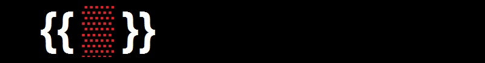
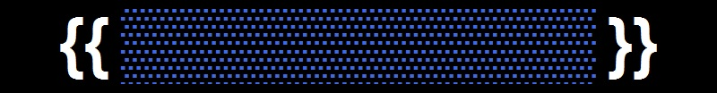
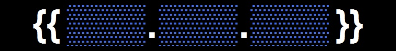
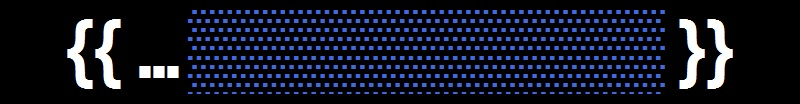
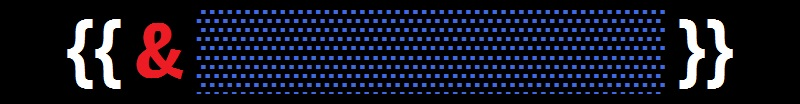
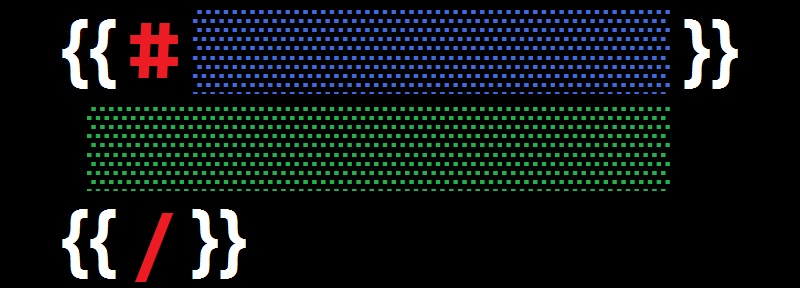
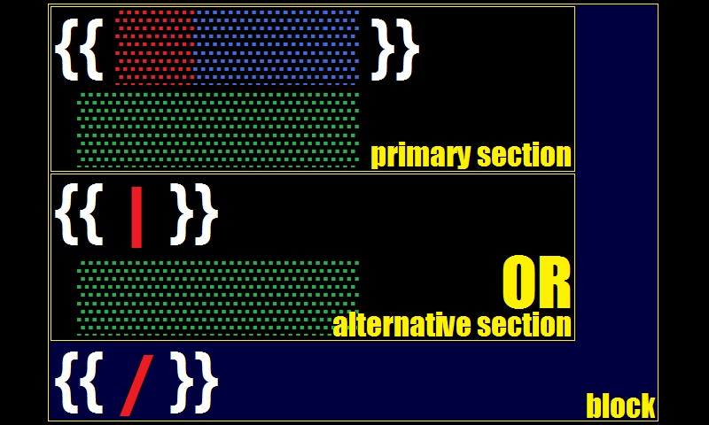

# mustache
[](#about-)
## about <!-- {{{ -->
`SM\Mustache` is a
***template processor***<sup>[◥][m-engine]</sup>
implementation of ***mustache templates***<sup>[◥][template]</sup>
written in ***PHP***<sup>[◥](https://www.php.net/)</sup>
and compatible with
***mustache specification***<sup>[◥](https://github.com/mustache/spec)</sup>
in its reasonable parts.

### history
- [the-parable-of-mustache-js](https://writing.jan.io/2013/11/01/the-parable-of-mustache-js.html)
- [mustache-2.0](https://writing.jan.io/mustache-2.0.html)

### performance
running in ***the JIT mode***<sup>[◥](https://php.watch/versions/8.0/JIT)</sup>,
this implementation is comparable to various JS implementations:
[](#performance)

### principles
- `logic-less` - in comparison with other template processors, where data is sliced and diced inside the template, this implementation strives to control the **data flow** through the template. in practice, it looks like **more concise syntax** with selections instead of cryptic expressions. thus, **less mental load** - more templating.
- `data for template` - template is more important than data, a variety sets of data may fit into a single template. paths used in the **template should look nice**, readable and explanatory. the question of escaping sigils to accommodate data should never arise - avoid `template for data` at all costs, do a preliminary **data massaging** when necessary.
- `??` - **use of helpers** is recommended.
<!-- }}} -->
## syntax <!-- {{{ -->
### clauses
[](#clauses)
> *The army consists of the first infantry division and eight million replacements.*
> 
> **Sebastian Junger**

the smallest unit of
***mustache language***<sup>[◥][m-lang]</sup>
is the ***clause***<sup>[◥][m-clause]</sup>
which is ***removed or replaced***<sup>[◥][substitution]</sup>
in the [resulting output](#examples).

a clause consists of:
- [delimiters](#delimiters)
- [sigil](#sigils) (optional)
- [path](#paths) or ***literal***<sup>[◥][literal]</sup> or ***annotation***<sup>[◥][annotation]</sup> (optional)

there are two kinds of clauses:
- ***independent***<sup>[◥][m-clause-ind]</sup> are [variables](#variables) and [comments](#comments).
- ***dependent***<sup>[◥][m-clause-dep]</sup> are composed in [blocks](#blocks).


### delimiters
[](#delimiters)

***delimiters***<sup>[◥][m-delims]</sup> are
a ***pair of markers***
that ***frame the stem***<sup>[◥][circumfix]</sup>
of a [clause](#clauses) in the template.
the default are **`{{`** and **`}}`**
which look like a ***moustache***<sup>[◥][moustache]</sup>.

the first delimiter is called ***opening***,
the second - ***closing***.

***custom delimiters*** may be set at
[the phase of preparation](#preparation).
some examples: `{: :}`, `/* */`, `<{ }>`, `<[ ]>`,
`<% %>`, `[% %]`, ``, `(( ))`, `[[ ]]`, `<!--{ }-->`, `{{{ }}}`.

such balanced delimiters do not have to mirror each other or
be of equal length, but they ***must differ***
to avoid ***delimiter collision***.
a single character may also be used as a delimiter, but:
> *There is no such thing as accident; It is fate misnamed.*
> 
> **Napoleon Bonaparte**


### sigils
[](#sigils)

a ***sigil***<sup>[◥][sigil]</sup>
is a ***symbol***<sup>[◥][symbol]</sup>
that is ***suffixed***<sup>[◥][suffix]</sup>
to [the opening delimiter](#delimiters).

a ***sigil*** effectively ***denotes the type*** of [clause](#clauses):
- `&` - [variable](#variables) (optional modifier)
- `!` - [commentary](#comments)
- `#`,`^`,`@` - [primary section](#blocks)
- `|` - [alternative section](#OR-section)
- `/` - [terminus](#terminus)


### paths
[](#paths)

a ***path***<sup>[◥][m-path]</sup>
consists of ***one or multiple names***<sup>[◥][name-value]</sup>
that indicate ***the address of a value***<sup>[◥][name-binding]</sup>
on [the context stack](#the-context-stack).

it is crusial to follow a rigid
***naming convention***<sup>[◥][naming]</sup> -
use of ***alphanumeric characters***<sup>[◥][alnum]</sup>
and one of word combinatory practices -
***hyphen-case***<sup>[◥][hyphen-case]</sup>,
***camelCase***<sup>[◥][camelCase]</sup> or
***snake_case***<sup>[◥][snake_case]</sup>
is recommended.
the name cannot contain a ***dot***<sup>[◥][dot]</sup>
or ***whitespace***<sup>[◥][whitespace]</sup>
characters - they have a special meaning.

#### dot notation
[](#dot-notation)

***multiple names*** in the path
***are joined***<sup>[◥][interfix]</sup>
with the ***dot***<sup>[◥][dot]</sup> character.

for example, the path consisting of two names - `first.second`
assumes that the `first` name ***points to the container***<sup>[◥][container]</sup>
and the `second` name points to ***the value inside*** that container.
for the `first.second.third` path, the rule extrapolates -
the `third` value ***must be extracted*** from the `second` container
which must be extracted from the `first` container.
that is, the `first.second` value contains the `third` value,
which is simply a `first.second.third` value.

#### absolute path
[](#absolute-path)

a ***path*** that is ***prefixed***<sup>[◥][prefix]</sup>
with ***one or multiple dots***
is called ***absolute***<sup>[◥][abs-path]</sup>.

[](#absolute-path)

for example, in the `.name` path,
a ***single dot***<sup>[◥][dot]</sup>
points to the ***top of the stack***,
which must be the ***container***<sup>[◥][container]</sup>
where the `name` resides.
in the `..name`, there is a ***double dot***
pointing downwards (***top to bottom***)
to the ***second container***<sup>[◥][container]</sup>
on [the stack](#the-context-stack) and the `name` value inside that container.
in the `...name`, a ***triple dot*** points to
the ***third value*** on [the stack](#the-context-stack)
and so on..

such a prefixed dot notation is called a **backpedal** -
it requires knowledge of [the stack](#the-context-stack) contents.
thus, an ***absolute path***<sup>[◥][abs-path]</sup>
implies an **explicit selection**<sup>[◥][stack-peek]</sup>
of value.

#### relative path
a [path](#paths) with ***no backpedal***
is called ***relative***<sup>[◥][rel-path]</sup> -
the first name is ***searched***<sup>[◥][linear-search]</sup>
on [the stack](#the-context-stack) (rather than peeked).

the ***search*** goes from ***top to bottom***
only inside of ***container***<sup>[◥][container]</sup>
values. when the first name is found,
but [the dot notation](#dot-notation) fails,
the search does not resume.

#### lambda path
[](#lambda-path)

when a ` ` ***space***<sup>[◥][space]</sup> character
is met ***in the path***,
it denotes the end of
[the path that resolves to lambda](#lambdas) and
the start of the ***argument***<sup>[◥][argument]</sup>
to that lambda.


### variables
[](#variables)
> *Make everything as simple as possible, but not simpler.*
> 
> **Albert Einstein**

a ***variable***<sup>[◥][m-var]</sup>
is an ***independent***<sup>[◥][m-clause-ind]</sup>
[clause](#clauses)
of ***mustache language***<sup>[◥][m-lang]</sup>
that consists of [delimiters](#delimiters)
and [path](#paths).

a ***variable***<sup>[◥][m-var]</sup>
may be ***affixed***<sup>[◥][affix]</sup>
with the **`&`** [sigil](#sigils) -
a ***modifier***<sup>[◥][modifier]</sup>
that [controls the escaping](#escaping)
of the value.
***escaping***<sup>[◥][escape-char]</sup>
is only a historical title for
a common ***post-processing mechanism***
which ***is disabled by default*** -
the affix has no effect.

### indentation
***for better appearance***<sup>[◥][readability]</sup>,
[clause](#clauses) components
([delimiters](#delimiters), [sigil](#sigils) and [path](#paths))
***can align with each other***<sup>[◥][free-form]</sup>
using ***whitespace***<sup>[◥][whitespace]</sup>.

for example, `{{ & path.to.value }}` equals to `{{&path.to.value}}`,
but don't forget that [path](#paths) itself
cannot be indented with whitespace -
the `{{&path . to . value}}` is incorrect.

### comments
[](#comments)
```
{{!

  When I read commentary
  about suggestions for where C should go,
  I often think back and give thanks that
  it wasn't developed under
  the advice of a worldwide crowd.

  Dennis Ritchie 🚀

}}
```
a ***comment***<sup>[◥][m-comment]</sup>
is an ***independent***<sup>[◥][m-clause-ind]</sup>
[clause](#clauses)
of ***mustache language***<sup>[◥][m-lang]</sup>
that consists of [delimiters](#delimiters),
the **`!`** [sigil](#sigils)
and ***annotation***<sup>[◥][annotation]</sup>.

[upon rendering](#rendering), a comment
***is stripped***<sup>[◥][substitution]</sup>
from the [resulting output](#examples).


### blocks
[](#blocks)

a ***block***<sup>[◥][m-block]</sup>
consists of one or more ***sections***<sup>[◥][m-section]</sup> and
a [terminus](#terminus).

a ***section***<sup>[◥][m-section]</sup>
consists of a ***dependent***<sup>[◥][m-clause-ind]</sup>
[clause](#clauses)
and a ***section's content***<sup>[◥][template]</sup>
that ends with a [terminus](#terminus) or another ***section***.

> *A dependent clause is like a dependent child: incapable of standing on its own but able to cause a lot of trouble.*
> 
> **William Safire**

the ***first section*** of a block,
or the ***primary section*** -
determines the ***block type***.
its [clause](#clauses)
represents a ***conditional construct***<sup>[◥][m-conditional]</sup>
that tests resolved ***value***<sup>[◥][value]</sup>
for [truthiness or falsiness](#truthy-or-falsy) -
the ***result***<sup>[◥][boolean]</sup>
influences the way the block renders.

standard ***block types*** ([sigils](#sigils)) are:
- [**`#`**](#TRUTHY-block),[**`@`**](#ITERATOR-block) - [expects truthy](#truthy-or-falsy)
- [**`^`**](#FALSY-block) - [expects falsy](#truthy-or-falsy)

any ***subsequent section***<sup>[◥][cond-subsequent]</sup>
is called an [alternative section](#OR-section)
and its [clause](#clauses) ***is affixed***<sup>[◥][affix]</sup>
with [**`|`**](#OR-section) [sigil](#sigils).

[upon rendering](#rendering), a block is
***removed or replaced***<sup>[◥][substitution]</sup>
as a whole.

#### truthy or falsy
> *I cannot comprehend how any man can want anything but the truth.*
> 
> **Marcus Aurelius**

the [path](#paths) of a ***primary section***
resolves to a ***value***<sup>[◥][value]</sup>
which ***is coerced***<sup>[◥][coercion]</sup>
to a ***boolean***<sup>[◥][boolean]</sup>.
when it coerces to ***false*** - its ***falsy***,
otherwise, it is ***true*** and ***truthy***.

this ***mustache***<sup>[◥][m-lang]</sup> implementation
defines the following ***falsy*** values:
- `unfound` - when [path](#paths) resolves to ***nothing***<sup>[◥][null]</sup> (value not found)
- `false` - ***boolean***<sup>[◥][boolean]</sup> (no coercion)
- `0` - ***zero number***<sup>[◥][zero]</sup>
- ***empty string***<sup>[◥][empty-string]</sup>
- `[]` - empty ***array***<sup>[◥][php-array]</sup>
- empty ***countable object***<sup>[◥][php-countable]</sup>

every other value - is ***truthy***.

#### FALSY block
[](#FALSY-block)

this block type ***is the simplest*** -
its primary section is rendered only when [the path](#paths)
resolves to [falsy](#truthy-or-falsy).
```
{{^array-count}}
  array is empty,
  number of elements is 0
{{/}}
{{^array}}
  array is empty
{{/}}
{{^user.active}}
  user {{user.name}} is not active
{{/}}
```

#### TRUTHY block
[](#TRUTHY-block)

the primary section of this block
is rendered only when [the path](#paths)
resolves to [truthy](#truthy-or-falsy).

for a ***boolean*** value,
it behaves the ***same as negated***
[falsy block](#FALSY-block):
```
{{#user.active}}
  user {{user.name}} is active
{{/}}
```
for a ***non-boolean scalar*** (string or number) or
for a ***non-iterable container*** (array or object),
the value is pushed to [the context stack](#the-context-stack)
and becomes a ***temporary helper*** that is accessible
with a [`.` backpedal](#absolute-path)
and is pulled after a single render:
```
{{#array-count}}
  number of elements in array: {{.}}
{{/}}
{{#user}}
  user name is {{.name}}
{{/}}
```
for a ***iterable container***<sup>[◥][php-countable]</sup>
(array or object), the value ***is iterated*** -
each element is pushed to [the context stack](#the-context-stack),
rendered and pulled out:
```
{{#array}}
  value={{.}};
{{/}}
```
that is, the primiary section is rendered as many times,
as many elements are in the container,
but the stack expands only for a single value.


#### ITERATOR block
[](#ITERATOR-block)

this block improves the ***iteration capability***<sup>[◥][iterator]</sup>
of the [truthy block](#TRUTHY-block) and
introduces ***traversion capability***.
a ***truthy value*** resolved from [the path](#the-path)
must be a ***countable container***<sup>[◥][php-countable]</sup>,
otherwise a [processing exception](#errors) will be thrown.

a set of ***auxilary variables*** is created
for both iteration and traversion:
- `_first` - first iteration ***indicator***<sup>[◥][boolean]</sup>
- `_last` - last iteration ***indicator***<sup>[◥][boolean]</sup>
- `_index` - current iteration ***number***<sup>[◥][index]</sup>
- `_key` - current traverion ***name string***<sup>[◥][string]</sup>
- `_value` - current traversion value of ***mixed type***<sup>[◥][php-mixed]</sup>

thus,  extend :
```
{{@array}}
  {{_index}}={{.}};
{{/}}

{{@array}}
  {{.}}{{^_last}},{{/}}
{{/}}

{{@path.to.traversable.object}}
  {{_key}}: {{_value}}{{^_last}},{{/}}
{{/}}
```


***assistant*** [variables](#variables)
have a similar [`_` backpedal](#absolute-path)
but they live in a separate stack and
relate only to [iterator blocks](#ITERATOR-block).


#### OR section
[](#OR-section)

if-else block has two sections, one is always rendered
```
{{#block}} truthy {{|}} falsy {{/block}}
```
if-not-else block has two sections, one is always rendered
```
{{^block}} falsy {{|}} truthy {{/block}}
```

#### SWITCH block
switch block is composed of multiple sections.
when one section matches the value, it is rendered,
otherwise, block renders empty.
```
  {{#block}}
    when other sections dont match,
    will match TRUE or TRUTHY values
  {{|}}
    when other sections dont match,
    will match FALSE or FALSY values
  {{|0}}
    will match 0,"0"
  {{|1}}
    will match 1,"1"
  {{|2}}
    will match 2,"2"
  {{|hello}}
    will match "hello"
  {{/block}}
```

switch-not block is similar to if-not block.
only one section may be rendered.
it is more natural than switch block because default section is not the first one.
```
  {{^block}}
    falsy section
  {{|0}}
    zero (string)
  {{|1}}
    one (string/number)
  {{|2}}
    two (string/number)
  {{|}}
    truthy section (default)
  {{/block}}
```

#### terminus
[](#terminus)

a ***terminus***<sup>[◥][m-terminus]</sup>
is a ***dependent***<sup>[◥][m-clause-dep]</sup>
[clause](#clauses)
of ***mustache language***<sup>[◥][m-lang]</sup>
that consists of [delimiters](#delimiters),
the **`/`** [sigil](#sigils)
and an optional ***annotation***<sup>[◥][annotation]</sup>.

the only purpose of a ***terminus***<sup>[◥][m-terminus]</sup>
is to ***terminate the block***<sup>[◥][boundary-marker]</sup>.
```
{{/

  a terminus clause may look like a comment, irrelevant,
  but it depends on block's might, without it,
  there will be a terrible failure - a barbarian invasion!

  the opposite is also true - when a terminus is plowed
  by ignorant peasant, the block demarks itself as open
  to worldwide scum - a terrible failure!

}}
```

<!-- }}} -->
## usage <!-- {{{ -->
### the context stack
[](#the-context-stack)

internally, mustache instance represents
a ***stack***<sup>[◥](https://en.wikipedia.org/wiki/Stack_(abstract_data_type))</sup>.

any ***composite data***<sup>[◥][composite]</sup>
(an ***array***<sup>[◥](https://www.php.net/manual/en/language.types.array.php)</sup>
or an ***object***<sup>[◥](https://www.php.net/manual/en/language.oop5.php)</sup>)
pushed to the stack prior to template processing
is called a ***helper*** or a helper data or
a data that helps in rendering.

helpers may be set at instantiation:
```php
$m = SM\Mustache::new([# push one
  'helper' => $helper1
]);
$m = SM\Mustache::new([# push many
  'helpers' => [$helper1, $helper2, $helper3]
]);
```
or afterwards:
```php
$m->push($helper1);
$m->push($helper2)->push($helper3);
```
they can be removed with:
```php
$m->pull();# removes $helper3
$m->pull(true);# removes all
```


```php
$m = SM\Mustache::new([
  'helpers' => [
    ['name' => 'Joe',   'age' => 81, 'another' => ['name' => 'Sleepy']],
    ['name' => 'Barak', 'age' => 62],
    ['name' => 'Donald','another' => ['term' => 2024]]
  ]
]);
$m->value('name');# Donald
$m->value('age');# 62
$m->value('another.name');# NOT FOUND ~ null
$m->value('...another.name');# Sleepy
```
when `.` precedes a path, the value is fetched
rather than looked up, that is,
the `.` selector points to the top of the stack,
`..` to the second value from the top, etc.
```php
echo $m->value('.name');# Donald
echo $m->value('..name');# Barak
echo $m->value('...name');# Joe
```
### escaping
123
for example, putting `<World>` into:
```html
<p>Hello {{&name}}!</p>
```
with html escaping results in:
```html
<p>Hello &lt;World&gt;</p>
```

### preparation
> *There are no secrets to success. It is the result of preparation, hard work, and learning from failure.*
> 
> **Colin Powell**

delimiters are set once for the
***instance***<sup>[◥](https://en.wikipedia.org/wiki/Instance_(computer_science))</sup>
:
```php
$m = SM\Mustache::new(['delims' => '<% %>']);
```
or, arbitrarily, with
[preparational methods](#preparation)
:
```php
$txt = $m->prepare($template, $data, '[[ ]]');
$id  = $m->prep($template, '{: :}');;
```

### compilation (cache preset)
2

### rendering
3

yes, that's a feature i want to deviate a bit. make it opt in instead of opt out, meaning that {{&userInput}} is whats going to be escaped. im not sure how to do that, maybe an option to the instance that inverts default behavior. it is based on HTML and proposition that templates are typed by users. developer knows exactly what "stage" currently is and whether it s a user input or template composition.

To go a little off topic here so I can understand better about your implementation I group Mustache implementations like this:

STATIC based
TRANSFORM based
REFLECTIVE based
oke, let me explain how i see stage things in the modern template EVALuator.
HTML-only days are over, so it must be generic view.

stage 1: preparation
templates should be somehow beautiful and easy to read and to modify - for example, check how beautiful are json spec files - long one-liners with zero indentation, yaml files, in this case, arent the source of truth, because they bypass stage 1 implicitly. json is what we need, big lengthy json objects with infinite one-liners.. (put some irony here).

i think you agree that template storage represents a hasmap - name=>template content, it can be filename (still a name) or json object key, also a name bound with content - string type. php arrays are better than JSON files, aesthetically. i bet any language does better job in template sourcing - better representation for a developer.

single template, one may wish to see is:

  {:BR:}{:TAB:}
  Hey, {{name}}, you are {:#ansi_color red:}{{age}}{:/ansi_color:} years old!
this tiny indentation brings an issue to non-HTML sources. "remove indentation around standalone blocks" feature in mustache doesnt fully do OUTdentation. the issue is obscure in HTML, because HTML usually eats any whitespace in the view. same as in yaml files, you dont see it. i think that explicit outdentation is required. mine has two methods for this stage:

function outdent(string $template): string;
function prepare(string $template, mixed $data=null, string $customDelimiters=''): string
the process may look like

foreach ($templateStorage as $name => &$template) {
  $template = $m->prepare($m->outdent($template), $initialData, '{: :}');
}
initial data may look like

[
  'BR' => "\n",
  'TAB' => "\t",
  'ansi_color' => (function(..){..}),
]
now template is explicitly indented for the target source (console/terminal that supports ansi sequences)

stage 2: compilation or cache preSET
this is completely optional. the only benefit of this stage is significant performance jump which is related to addressing mechanism - instead of copying potentially large strings and calculating hashes over them, you use identifiers. this not required for experiments or few template renderings. mine has a method:

function set(string $template): int
the process is similar

foreach ($templateStorage as $name => &$template) {
  $template = $m->set($template);
}
now templates are integers. getting text back is possible.

stage 3: rendering
is also optional. experiments and playgrounds dont need methods that use cache. few template renders are fine with prepare(). otherwise, yours is some kind of an app that renders periodically and able to benefit from caching and memoization. mine has:

function render(string $template, mixed $data=null): string;
function get(int $template, mixed $data=null): string;
rendering may look like

$result = $m->render($templateStorage[$name], $data);# or when precached
$result = $m->get($templateStorage[$name], $data);
regarding to lambdas,
i suppose that most of them will live a short life at the stage 1 and wont be invoked periodically as projected for stage 3. there is no need for constant ansi wraps or other special/control character insertion in a thoughtful template.

@jgonggrijp

So if I understand correctly, your implementation makes two passes over the template, one as a kind of preprocessing/macro expansion step and one for the final rendering.

yes, stage 1 and 2 can be treated as a single step.

What does the use ($ANSI) notation, between the function parameter list and the function body, mean in PHP?

it only passes external variable for use. in JS that is achieved by closure scopes, phps have that use () clause.

@agentgt

type NODE = STRING | BOOL | NULL | NUMBER | OBJECT | LIST | NODE
They do not know that "a" will even be there. However unlike the reflective model where it could be anything they just need to recursively pattern match the above.

With the reflective model you have to ask the type "tell me everything about you". In the transform model you ask "which of these types are you"?

i see it as optimization properties. i did some type memoization which is based on template then data, not data then template. im not determined about actual structure yet. for example {{lambda argument}} is clearly a function - because it has an argument - no need to typecheck here, so ill select fragility over implicit stability

also consider cache fragility:

$template = $m->outdent('

  {{#list}}
    {{.}}
  {{/list}}

');
echo $m->render($template, ['list'=>[1,2,3,4,5]]);# prints 12345, template is cached
echo $m->render($template, ['list'=>['one','two','three']]);# FATAL! - expecting integers in the array
echo $m->prepare($template, ['list'=>['one','two','three']]);# prints onetwothree, template cache is ignored

### lambdas
powerful

### errors
parse exceptions
render exceptions

<!-- }}} -->
## examples <!-- {{{ -->
### one
1
### two
2
### three
3
<!-- }}} -->
<!-- links {{{ -->

[m-engine]: https://en.wikipedia.org/wiki/Template_processor "the engine"
[m-lang]: https://en.wikipedia.org/wiki/Transformation_language "transformational"
[m-clause]: https://en.wikipedia.org/wiki/Clause
[m-clause-ind]: https://en.wikipedia.org/wiki/Independent_clause "solid"
[m-clause-dep]: https://en.wikipedia.org/wiki/Dependent_clause "composite"
[m-delims]: https://en.wikipedia.org/wiki/Delimiter "{{ }}"
[m-path]: https://en.wikipedia.org/wiki/Path_(computing)
[m-var]: https://en.wikipedia.org/wiki/Variable_(computer_science)
[m-comment]: https://en.wikipedia.org/wiki/Comment_(computer_programming) "a programmer-readable explanation or annotation in the source code"
[m-block]: https://en.wikipedia.org/wiki/Block_(programming)
[m-terminus]: https://en.wikipedia.org/wiki/Terminus_(god) "terminator, boundary"
[m-section]: https://dictionary.cambridge.org/dictionary/english/section "one of the parts that something is divided into"
[m-conditional]: https://en.wikipedia.org/wiki/Conditional_(computer_programming) "whether a value is truthy or falsy"
[literal]: https://en.wikipedia.org/wiki/Literal_(computer_programming) "textual representation of a value"
[moustache]: https://en.wikipedia.org/wiki/Moustache
[template]: https://en.wikipedia.org/wiki/Template_(word_processing) "template"
[substitution]: https://en.wikipedia.org/wiki/String_interpolation "substitution"
[symbol]: https://en.wikipedia.org/wiki/Symbol "a special character"
[sigil]: https://en.wikipedia.org/wiki/Sigil_(computer_programming) "affixed symbol"
[value]: https://en.wikipedia.org/wiki/Value_(computer_science)
[name-binding]: https://en.wikipedia.org/wiki/Name_binding "dynamic name binding"
[name-value]: https://en.wikipedia.org/wiki/Name%E2%80%93value_pair
[naming]: https://en.wikipedia.org/wiki/Naming_convention_(programming)
[alnum]: https://en.wikipedia.org/wiki/Alphanumericals "A–Z, a–z, 0–9"
[hyphen-case]: https://en.wikipedia.org/wiki/Hyphen
[camelCase]: https://en.wikipedia.org/wiki/Camel_case
[snake_case]: https://en.wikipedia.org/wiki/Snake_case
[container]: https://en.wikipedia.org/wiki/Associative_array
[dot]: https://en.wikipedia.org/wiki/Full_stop "full stop. period. full point."
[abs-path]: https://www.computerhope.com/jargon/a/absopath.htm
[rel-path]: https://www.computerhope.com/jargon/r/relapath.htm
[prefix]: https://en.wikipedia.org/wiki/Polish_notation "prefix"
[interfix]: https://en.wikipedia.org/wiki/Interfix "linking element"
[affix]: https://en.wikipedia.org/wiki/Affix
[suffix]: https://en.wikipedia.org/wiki/Suffix "postfix"
[circumfix]: https://en.wikipedia.org/wiki/Circumfix
[escape-char]: https://en.wikipedia.org/wiki/Escape_character
[modifier]: https://en.wikipedia.org/wiki/Grammatical_modifier
[stack-peek]: https://en.wikipedia.org/wiki/Peek_(data_type_operation)
[linear-search]: https://en.wikipedia.org/wiki/Linear_search
[free-form]: https://en.wikipedia.org/wiki/Free-form_language
[whitespace]: https://en.wikipedia.org/wiki/Whitespace_character#Programming_languages "SPACE, TAB, LINE FEED"
[space]: https://en.wikipedia.org/wiki/Space_(punctuation)
[argument]: https://en.wikipedia.org/wiki/Argument_of_a_function
[readability]: https://en.wikipedia.org/wiki/Readability "readability"
[annotation]: https://en.wikipedia.org/wiki/Annotation "extra information"
[boundary-marker]: https://en.wikipedia.org/wiki/Boundary_marker
[cond-precedent]: https://en.wikipedia.org/wiki/Condition_precedent "required before something else will occur"
[cond-subsequent]: https://en.wikipedia.org/wiki/Condition_subsequent "brings a duty to an end"
[boolean]: https://en.wikipedia.org/wiki/Boolean_data_type
[coercion]: https://en.wikipedia.org/wiki/Type_conversion
[null]: https://en.wikipedia.org/wiki/Null_pointer
[zero]: https://en.wikipedia.org/wiki/0
[empty-string]: https://en.wikipedia.org/wiki/Empty_string
[string]: https://en.wikipedia.org/wiki/String_(computer_science)
[composite]: https://en.wikipedia.org/wiki/Composite_data_type
[iterator]: https://en.wikipedia.org/wiki/Iterator
[lambda]: https://en.wikipedia.org/wiki/Anonymous_function
[index]: https://en.wikipedia.org/wiki/Zero-based_numbering
[php-countable]: https://www.php.net/manual/en/class.countable.php
[php-array]: https://www.php.net/manual/en/language.types.array.php
[php-mixed]: https://www.php.net/manual/en/language.types.mixed.php
<!-- }}} -->
<!--::-->
