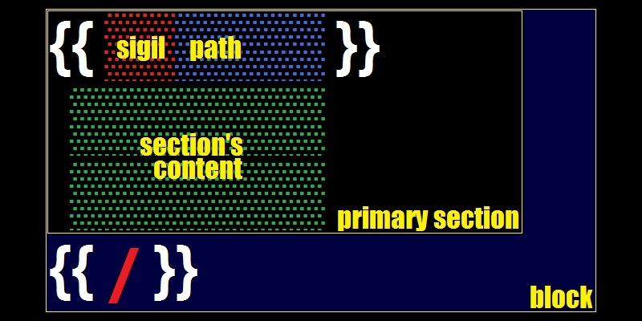
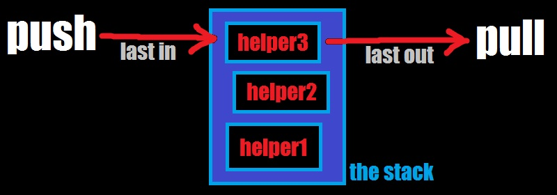

# mustache
## about <!-- {{{ -->
`SM\Mustache` is a
***template processor***<sup>[◥][m-engine]</sup> of
***mustache templates***<sup>[◥][template]</sup>
written in ***PHP***<sup>[◥](https://www.php.net/)</sup>
and compatible with
***mustache specification***<sup>[◥](https://github.com/mustache/spec)</sup>
in reasonable parts.

### history
- [the-parable-of-mustache-js](https://writing.jan.io/2013/11/01/the-parable-of-mustache-js.html)
- [mustache-2.0](https://writing.jan.io/mustache-2.0.html)

### performance
this implementation, running in the
***JIT mode***<sup>[◥](https://php.watch/versions/8.0/JIT)</sup>,
is comparable to various JS implementations


### principles
- `logic-less` - in comparison with other template processors, where data is sliced and diced inside the template, this implementation strives to control the **data flow** through the template. in practice, it looks like **more concise syntax** with selections instead of cryptic expressions. thus, **less mental load** - more templating.
- `data for template` - template is more important than data, a variety sets of data may fit into a single template. paths used in the **template should look nice**, readable and explanatory. the question about escaping special characters to accommodate data should never arise - avoid `template for data` at all costs, do a preliminary **data massaging** when necessary.
- `??` - **use of helpers** is recommended.
<!-- }}} -->
## syntax <!-- {{{ -->
### clauses
> *The army consists of the first infantry division and eight million replacements.*
> 
> **Sebastian Junger**

the smallest unit of
***mustache language***<sup>[◥][m-lang]</sup>
is the ***clause***<sup>[◥][m-clause]</sup>
which is ***removed or replaced***<sup>[◥][substitution]</sup>
in the [resulting output](#examples).

a clause consists of [delimiters](#delimiters),
a [sigil](#the-sigil)
and/or a [path](#the-path).

there are two kinds of clauses -
***independent***<sup>[◥][m-clause-ind]</sup>,
which are self-contained
([variables](#variables) and [comments](#comments)),
and ***dependent***<sup>[◥][m-clause-dep]</sup>,
which make up [blocks](#blocks).

### delimiters


a ***pair of markers***<sup>[◥][m-delims]</sup>,
such as `{{` and `}}` (the default, which look like
***moustache***<sup>[◥][moustache]</sup>),
that effectively frame a [clause](#clauses) in the template.

delimiter examples: `{: :}`,`/* */`,`<% %>`,
`(( ))`,`<[ ]>`,`<!--{ }-->`,`{{{ }}}`..

such balanced delimiters dont have to mirror each other or
be of equal length, but they **must differ**
to avoid ***delimiter collision***.
even a single character might be used as a delimiter, but:
> *There is no such thing as accident; It is fate misnamed.*
> 
> **Napoleon Bonaparte**

delimiters are determined during
[the phase of preparation](#preparation).


### the sigil
the ***type and meaning*** of the [clause](#clauses) is determined
by a ***sigil***<sup>[◥][sigil]</sup>
that is ***suffixed***<sup>[◥][suffix]</sup>
to the opening [delimiter](#delimiters).

this implementation defines:
- `&` - [variable](#variables) modifier (optional)
- `!` - [commentary](#comments)
- `#`,`^`,`@` - [primary sections](#blocks)
- `|` - [supplementary section](#OR-section)
- `/` - [terminus](#terminus)


### the path


a ***path***<sup>[◥][m-path]</sup>
is ***the address of the value***<sup>[◥][name-binding]</sup>
in [the context stack](#the-context-stack).
it consists of one or multiple ***names***<sup>[◥][name-value]</sup>
and follows [the dot notation](#dot-notation).

it is crusial to follow a rigid
***naming convention***<sup>[◥][naming]</sup> -
use of ***alphanumeric characters***<sup>[◥][alnum]</sup>
and one of word combinatory practices -
***hyphen-case***<sup>[◥][hyphen-case]</sup>,
***camelCase***<sup>[◥][camelCase]</sup> or
***snake_case***<sup>[◥][snake_case]</sup>
is recommended.
name may not contain a dot `.` or a space ` ` character -
they have a special meaning.

#### dot notation
when a `.` is met somewhere in the path,
for example in `first.second`,
it is assumed that the `first` name points to
a ***container***<sup>[◥][container]</sup>
and the `second` name points to the value in that container.
for the `first.second.third` path, the rule extrapolates further -
the `third` value is to be extracted from the `second` nested container
which is extracted from the `first` container.

#### absolute path
when a ***dot is met first***<sup>[◥][prefix]</sup>,
the first value is **peeked**<sup>[◥][stack-peek]</sup>
from [the stack](#the-context-stack).
a single `.` - points to the top of the stack,
a double `..` - to the second value from the top,
`...` - to the third and so on.
such a **backpedal** requires the knowledge of stack contents.
thus, absolute path defines an **explict selection** of the value.

#### relative path
when a ***name is met first***<sup>[◥][infix]</sup>,
the first value is ***searched***<sup>[◥][linear-search]</sup>
in [the stack](#the-context-stack)
from top to bottom. that is, each value is checked -
it must be a ***container***<sup>[◥][container]</sup>
that contains the name.
when the name is found, the search does not resume -
in case [the dot notation](#dot-notation) applies but fails,
the path resolves as unfound.

### variables


a ***variable***<sup>[◥][m-var]</sup>
is an ***independent***<sup>[◥][m-clause-ind]</sup>
[clause](#clauses)
of ***mustache language***<sup>[◥][m-lang]</sup>
which consists of [delimiters](#delimiters)
and [path](#the-path).
> *Make everything as simple as possible, but not simpler.*
> 
> **Albert Einstein**

a variable ***can be affixed***<sup>[◥][affix]</sup>
with the **`&`** [sigil](#the-sigil) -
a ***modifier***<sup>[◥][modifier]</sup>
that disables or enables generic
***escaping of a string value***<sup>[◥][escape-char]</sup>.

for example, putting `<World>` into:
```html
<p>Hello {{&name}}!</p>
```
and having html opt-in escaping will result in:
```html
<p>Hello &lt;World&gt;</p>
```
escaping is one of [many possibilities](#preparation) -
the output can be transformed to suit other requirements.


### comments
```
{{!

  When I read commentary
  about suggestions for where C should go,
  I often think back and give thanks that
  it wasn't developed under the advice of a worldwide crowd.

  Dennis Ritchie 🚀

}}
```
a ***comment***<sup>[◥][m-comment]</sup>
is an ***independent***<sup>[◥][m-clause-ind]</sup>
[clause](#clauses)
of ***mustache language***<sup>[◥][m-lang]</sup>
which consists of [delimiters](#delimiters),
the **`!`** [sigil](#the-sigil)
and ***commentary content***.

[upon rendering](#rendering), a comment
***is stripped***<sup>[◥][substitution]</sup>
from the [resulting output](#examples).

### inner indentation
***for better appearance***<sup>[◥][readability]</sup>,
[clause](#clauses) components
([delimiters](#delimiters), [sigil](#the-sigil) and [path](#the-path]))
***can align with each other***<sup>[◥][free-form]</sup>
using ***whitespace***<sup>[◥][whitespace]</sup>.

for example `{{ & path.to.value }}` equals to `{{&path.to.value}}`,
but don't forget that [the path](#the-path) itself
cannot use whitespace for indentation -
the `{{ & path . to . value }}` is incorrect.


### blocks


a ***block***<sup>[◥][m-block]</sup>
consists of one or more ***sections***<sup>[◥][m-section]</sup> and
a ***terminus***<sup>[◥][m-terminus]</sup>.

[upon rendering](#rendering), a block is
***removed or replaced***<sup>[◥][substitution]</sup>
as a whole.

a ***section***<sup>[◥][m-section]</sup>
consists of ***section's clause***
and ***section contents***<sup>[◥][template]</sup>
that ends with ***terminus***<sup>[◥][m-terminus]</sup>
or another ***section***.

> *A dependent clause is like a dependent child: incapable of standing on its own but able to cause a lot of trouble.*
> 
> **William Safire**

a ***section's clause***
is a ***dependent***<sup>[◥][m-clause-dep]</sup>
[clause](#clauses)
of ***mustache language***<sup>[◥][m-lang]</sup>
which consists of [delimiters](#delimiters)
[sigil](#the-sigil) and [path](#the-path).

the ***first section of the block*** or the ***primary section***
determines the type of the block.


#### terminus

```
{{/

  a terminus clause may look like a commentary, irrelevant,
  but it dependent on block's might, without it,
  there will be a terrible failure - a barbarian invasion.

  the opposite is also true - when a terminus is plowed
  by ignorant peasant, the block demarks itself as open
  to worldwide scum - a terrible failure!

}}
```

#### FALSY block
if-not block is rendered when block value is falsy
```
{{^block}} falsy {{/block}}
```

#### TRUTHY block
if block is rendered when block value is truthy
```
{{#block}} truthy {{/block}}
```

#### ITERABLE block

#### OR section
if-else block has two sections, one is always rendered
```
{{#block}} truthy {{|}} falsy {{/block}}
```
if-not-else block has two sections, one is always rendered
```
{{^block}} falsy {{|}} truthy {{/block}}
```

#### SWITCH block
switch block is composed of multiple sections.
when one section matches the value, it is rendered,
otherwise, block renders empty.
```
  {{#block}}
    when other sections dont match,
    will match TRUE or TRUTHY values
  {{|}}
    when other sections dont match,
    will match FALSE or FALSY values
  {{|0}}
    will match 0,"0"
  {{|1}}
    will match 1,"1"
  {{|2}}
    will match 2,"2"
  {{|hello}}
    will match "hello"
  {{/block}}
```

switch-not block is similar to if-not block.
only one section may be rendered.
it is more natural than switch block because default section is not the first one.
```
  {{^block}}
    falsy section
  {{|0}}
    zero (string)
  {{|1}}
    one (string/number)
  {{|2}}
    two (string/number)
  {{|}}
    truthy section (default)
  {{/block}}
```

### lambdas
<!-- }}} -->
## usage <!-- {{{ -->
### escaping
### the context stack


internally, mustache instance represents
a ***stack***<sup>[◥](https://en.wikipedia.org/wiki/Stack_(abstract_data_type))</sup>.

any ***composite data***<sup>[◥](https://en.wikipedia.org/wiki/Composite_data_type)</sup>
(an ***array***<sup>[◥](https://www.php.net/manual/en/language.types.array.php)</sup>
or an ***object***<sup>[◥](https://www.php.net/manual/en/language.oop5.php)</sup>)
pushed to the stack prior to template processing
is called a ***helper*** or a helper data or
a data that helps in rendering.

helpers may be set at instantiation:
```php
$m = SM\Mustache::new([# push one
  'helper' => $helper1
]);
$m = SM\Mustache::new([# push many
  'helpers' => [$helper1, $helper2, $helper3]
]);
```
or afterwards:
```php
$m->push($helper1);
$m->push($helper2)->push($helper3);
```
they can be removed with:
```php
$m->pull();# removes $helper3
$m->pull(true);# removes all
```


```php
$m = SM\Mustache::new([
  'helpers' => [
    ['name' => 'Joe',   'age' => 81, 'another' => ['name' => 'Sleepy']],
    ['name' => 'Barak', 'age' => 62],
    ['name' => 'Donald','another' => ['term' => 2024]]
  ]
]);
$m->value('name');# Donald
$m->value('age');# 62
$m->value('another.name');# NOT FOUND ~ null
$m->value('...another.name');# Sleepy
```
when `.` precedes a path, the value is fetched
rather than looked up, that is,
the `.` selector points to the top of the stack,
`..` to the second value from the top, etc.
```php
echo $m->value('.name');# Donald
echo $m->value('..name');# Barak
echo $m->value('...name');# Joe
```

### preparation
> *There are no secrets to success. It is the result of preparation, hard work, and learning from failure.*
> 
> **Colin Powell**

delimiters are set once for the
***instance***<sup>[◥](https://en.wikipedia.org/wiki/Instance_(computer_science))</sup>
:
```php
$m = SM\Mustache::new(['delims' => '<% %>']);
```
or, arbitrarily, with
[preparational methods](#preparation)
:
```php
$txt = $m->prepare($template, $data, '[[ ]]');
$id  = $m->prep($template, '{: :}');;
```

### compilation (cache preset)
2

### rendering
3

yes, that's a feature i want to deviate a bit. make it opt in instead of opt out, meaning that {{&userInput}} is whats going to be escaped. im not sure how to do that, maybe an option to the instance that inverts default behavior. it is based on HTML and proposition that templates are typed by users. developer knows exactly what "stage" currently is and whether it s a user input or template composition.

To go a little off topic here so I can understand better about your implementation I group Mustache implementations like this:

STATIC based
TRANSFORM based
REFLECTIVE based
oke, let me explain how i see stage things in the modern template EVALuator.
HTML-only days are over, so it must be generic view.

stage 1: preparation
templates should be somehow beautiful and easy to read and to modify - for example, check how beautiful are json spec files - long one-liners with zero indentation, yaml files, in this case, arent the source of truth, because they bypass stage 1 implicitly. json is what we need, big lengthy json objects with infinite one-liners.. (put some irony here).

i think you agree that template storage represents a hasmap - name=>template content, it can be filename (still a name) or json object key, also a name bound with content - string type. php arrays are better than JSON files, aesthetically. i bet any language does better job in template sourcing - better representation for a developer.

single template, one may wish to see is:

  {:BR:}{:TAB:}
  Hey, {{name}}, you are {:#ansi_color red:}{{age}}{:/ansi_color:} years old!
this tiny indentation brings an issue to non-HTML sources. "remove indentation around standalone blocks" feature in mustache doesnt fully do OUTdentation. the issue is obscure in HTML, because HTML usually eats any whitespace in the view. same as in yaml files, you dont see it. i think that explicit outdentation is required. mine has two methods for this stage:

function outdent(string $template): string;
function prepare(string $template, mixed $data=null, string $customDelimiters=''): string
the process may look like

foreach ($templateStorage as $name => &$template) {
  $template = $m->prepare($m->outdent($template), $initialData, '{: :}');
}
initial data may look like

[
  'BR' => "\n",
  'TAB' => "\t",
  'ansi_color' => (function(..){..}),
]
now template is explicitly indented for the target source (console/terminal that supports ansi sequences)

stage 2: compilation or cache preSET
this is completely optional. the only benefit of this stage is significant performance jump which is related to addressing mechanism - instead of copying potentially large strings and calculating hashes over them, you use identifiers. this not required for experiments or few template renderings. mine has a method:

function set(string $template): int
the process is similar

foreach ($templateStorage as $name => &$template) {
  $template = $m->set($template);
}
now templates are integers. getting text back is possible.

stage 3: rendering
is also optional. experiments and playgrounds dont need methods that use cache. few template renders are fine with prepare(). otherwise, yours is some kind of an app that renders periodically and able to benefit from caching and memoization. mine has:

function render(string $template, mixed $data=null): string;
function get(int $template, mixed $data=null): string;
rendering may look like

$result = $m->render($templateStorage[$name], $data);
# or when precached
$result = $m->get($templateStorage[$name], $data);
regarding to lambdas,
i suppose that most of them will live a short life at the stage 1 and wont be invoked periodically as projected for stage 3. there is no need for constant ansi wraps or other special/control character insertion in a thoughtful template.

@jgonggrijp

So if I understand correctly, your implementation makes two passes over the template, one as a kind of preprocessing/macro expansion step and one for the final rendering.

yes, stage 1 and 2 can be treated as a single step.

What does the use ($ANSI) notation, between the function parameter list and the function body, mean in PHP?

it only passes external variable for use. in JS that is achieved by closure scopes, phps have that use () clause.

@agentgt

type NODE = STRING | BOOL | NULL | NUMBER | OBJECT | LIST | NODE
They do not know that "a" will even be there. However unlike the reflective model where it could be anything they just need to recursively pattern match the above.

With the reflective model you have to ask the type "tell me everything about you". In the transform model you ask "which of these types are you"?

i see it as optimization properties. i did some type memoization which is based on template then data, not data then template. im not determined about actual structure yet. for example {{lambda argument}} is clearly a function - because it has an argument - no need to typecheck here, so ill select fragility over implicit stability

also consider cache fragility:

$template = $m->outdent('

  {{#list}}
    {{.}}
  {{/list}}

');
echo $m->render($template, ['list'=>[1,2,3,4,5]]);# prints 12345, template is cached
echo $m->render($template, ['list'=>['one','two','three']]);# FATAL! - expecting integers in the array
echo $m->prepare($template, ['list'=>['one','two','three']]);# prints onetwothree, template cache is ignored

<!-- }}} -->
## examples <!-- {{{ -->
### one
1
### two
2
### three
3
<!-- }}} -->
<!-- links {{{ -->

[m-engine]: https://en.wikipedia.org/wiki/Template_processor "the engine"
[m-lang]: https://en.wikipedia.org/wiki/Transformation_language "transformational"
[m-clause]: https://en.wikipedia.org/wiki/Clause
[m-clause-ind]: https://en.wikipedia.org/wiki/Independent_clause "solid"
[m-clause-dep]: https://en.wikipedia.org/wiki/Dependent_clause "composite"
[m-delims]: https://en.wikipedia.org/wiki/Delimiter "{{ }}"
[m-path]: https://en.wikipedia.org/wiki/Path_(computing)
[m-var]: https://en.wikipedia.org/wiki/Variable_(computer_science)
[m-comment]: https://en.wikipedia.org/wiki/Comment_(computer_programming) "a programmer-readable explanation or annotation in the source code"
[m-block]: https://en.wikipedia.org/wiki/Block_(programming)
[m-terminus]: https://en.wikipedia.org/wiki/Terminus_(god) "terminator, boundary"
[m-section]: https://dictionary.cambridge.org/dictionary/english/section "one of the parts that something is divided into"
[moustache]: https://en.wikipedia.org/wiki/Moustache
[template]: https://en.wikipedia.org/wiki/Template_(word_processing)
[substitution]: https://en.wikipedia.org/wiki/String_interpolation "substitution"
[sigil]: https://en.wikipedia.org/wiki/Sigil_(computer_programming) "affixed symbol"
[value]: https://en.wikipedia.org/wiki/Value_(computer_science)
[name-binding]: https://en.wikipedia.org/wiki/Name_binding "dynamic name binding"
[name-value]: https://en.wikipedia.org/wiki/Name%E2%80%93value_pair
[naming]: https://en.wikipedia.org/wiki/Naming_convention_(programming)
[alnum]: https://en.wikipedia.org/wiki/Alphanumericals "A–Z, a–z, 0–9"
[hyphen-case]: https://en.wikipedia.org/wiki/Hyphen
[camelCase]: https://en.wikipedia.org/wiki/Camel_case
[snake_case]: https://en.wikipedia.org/wiki/Snake_case
[container]: https://en.wikipedia.org/wiki/Associative_array
[prefix]: https://en.wikipedia.org/wiki/Polish_notation "prefix"
[infix]: https://en.wikipedia.org/wiki/Infix_notation "in-between"
[affix]: https://en.wikipedia.org/wiki/Affix
[suffix]: https://en.wikipedia.org/wiki/Suffix "postfix"
[escape-char]: https://en.wikipedia.org/wiki/Escape_character
[modifier]: https://en.wikipedia.org/wiki/Grammatical_modifier
[stack-peek]: https://en.wikipedia.org/wiki/Peek_(data_type_operation)
[linear-search]: https://en.wikipedia.org/wiki/Linear_search
[free-form]: https://en.wikipedia.org/wiki/Free-form_language
[whitespace]: https://en.wikipedia.org/wiki/Whitespace_character#Programming_languages "SPACE, TAB, LINE FEED"
[readability]: https://en.wikipedia.org/wiki/Readability "readability"
<!-- }}} -->
<!--::-->
